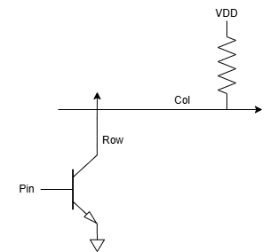

## Introduction

In this lab you will learn how to use time multiplexing to efficiently use the I/O on your FPGA.

* [Specs](specs.qmd)
* [AI Prototype](ai-prototype.qmd)
* You'll need the [ice40 datasheet](../../assets/doc/FPGA-DS-02008-2-0-iCE40-UltraPlus-Family-Data-Sheet.pdf) to do some LED calculations. Check out section 4.17.

## Learning Objectives

By the end of this lab you will have...

* Implemented a time-multiplexing scheme to drive two seven-segment displays with a single set of FPGA I/O pins.
* Built a simple transistor circuit to drive large currents from the FPGA pins.
* Installed a keypad and verified that logic signals can pass through it.
* Practiced your ability to build Verilog systems in a modular way.

## Requirements

Display two independent hexadecimal numbers on your dual seven-segment display. Use a DIP switch and four other input pins (possibly connected to a DIP switch on a breadboard) to provide the data for two hexadecimal numbers. You **must** use a single seven-segment decoder HDL module to drive the cathodes for both digits on the display, which therefore must be wired for multiplexed operation. The seven segment display should be oriented to display the numbers upright to the viewer.

Also, build a scanning circuit that has four outputs that rotate between exerting 1000, 0100, 0010, and 0001 such that each bit toggles at a rate of 2 Hz. Attach the outputs of the scanning circuit to the rows of a keypad (see below), and attach the columns to input pins. Read the input pins with your Verilog module and drive them back out onto LEDs. The result of this arrangement should be that you can press a key on the keypad to cause an LED to blink. This should be tolerant of multiple key presses, so be mindful of pullup (or pulldown) resistors and logic levels.

## Discussion

Time-multiplexing is a technique to share a common expensive hardware resource for several purposes at different times. For example, the multicycle processor in E85 multiplexed the memory for both instruction and data access and multiplexed the ALU for data processing instructions, branch calculations, and program counter increments.

In this lab, you will time-multiplex your seven-segment decoder module to run both halves of a dual display. A convenient way to control which half is active is to turn ON the common anode of only one display at a time. The anode requires substantial current, more than an FPGA output pin can drive. You can use a transistor to drive the large current. The lab has a stock of 2N3906 PNP transistors suitable for this purpose. Be sure to limit the base current so that you don’t draw too much current from the FPGA pin and choose a suitable switching speed. If you switch too slowly, your eye will notice the flicker. If you switch too fast for the electronics, the two digits will bleed together.

A matrix keypad has four rows and four columns, connected to 8 pins, as shown below for two different models. When you press a key, the corresponding row and column are connected. Check this with a multimeter to confirm your pinout.

::: {#fig-keypad-pinout}

{width=90%}

Pinout of keypads.
:::

One way to interrogate a matrix keypad is to assert signals on each row one at a time, then observe the values of the columns.  The scanning module you are building is designed to carry out just such an interrogation. 

However, multiple touches on the keypad can result in unusual electrical conditions: pressing two keys in the same column will short two row drivers, which can result in difficult to predict voltages (nominally VDD/2).  The way to address this problem is using something called an **open-drain output**, which is a type of output output driven by the drain/collector of a transistor (see figure below).  When the output is asserted, the transistor will pull down, but when the output is deasserted, the transistor will be off and the output will be floating.  This allows multiple outputs to be connected together without shorting them together.  The FPGA pins are not open-drain, but you can use a simple circuit to convert a normal output to an open-drain output: have your pin drive the gate/base of a transistor and have the source/emitter connected to ground.  The lab has a stock of 2N3904 NPN transistors suitable for this purpose.  Be sure to limit the base current so that you don’t draw too much current from the FPGA pin.

::: {#fig-open-drain}

{width=90%}

Pinout of keypads.
:::

Open drain outputs _must_ be used with a pullup transistor.  If there is no pullup, then output cannot ever reach VDD: remember, when the output is deasserted the transistor is off and the output is floating.  Adding pullups to the input pins (the colums of the keypad), or even relaying on internal pullups, can suffice to pull up signals in this case.

The specifications are prescriptive about the structure of this scanning module: it should consist of a counter and some output logic. That means that the scanning module is a kind of non-canonical state machine: the state register and state update logic are contained in the counter, and the output logic you will implement converts from the state (the count) to the four outputs.

## Hints

Look at your RTL schematic in your synthesis tool (`Tools -> Netlist Analyzer`). Understand why your code produces the hardware you see. Be sure your combinational logic doesn’t have any registers. Be sure your logic has no latches or tristate buffers. The oscilloscope is handy for tracking down timing problems.

