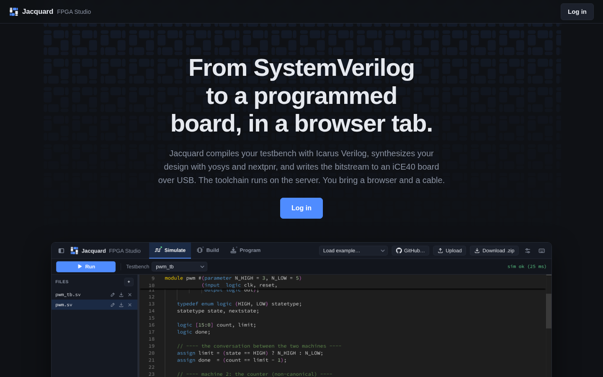
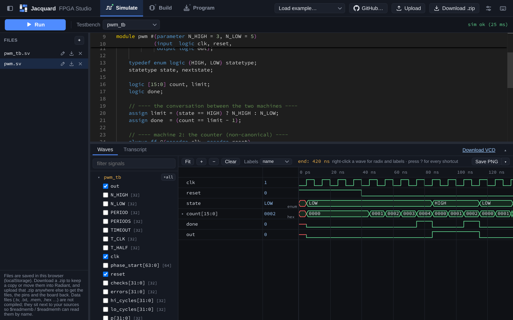
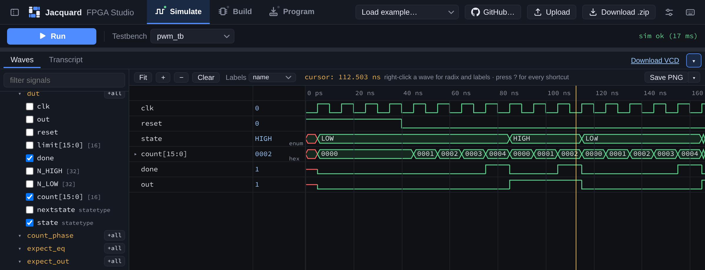
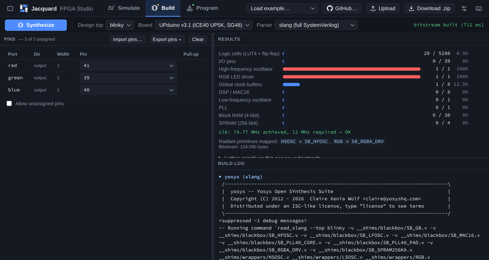
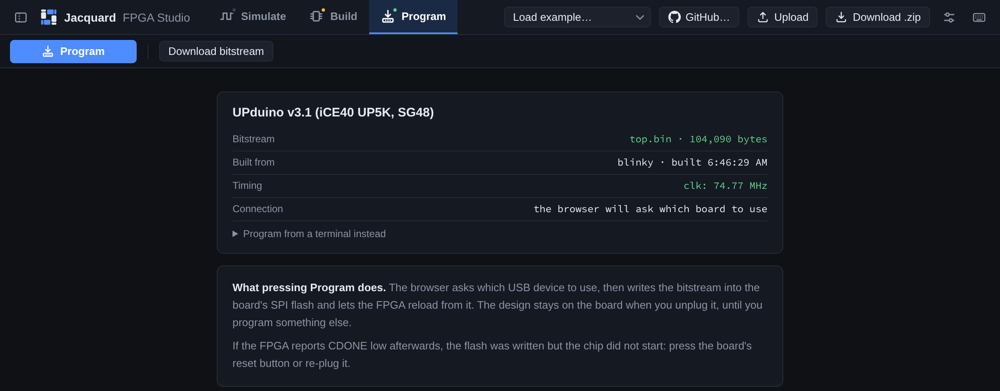

## Introduction

[Jacquard FPGA Studio]() is a browser-based tool that takes you from SystemVerilog to a programmed board without installing or licensing anything.
It compiles and simulates your testbench with Icarus Verilog, synthesizes your design with yosys and nextpnr, and writes the bitstream to your UPduino over USB.
The toolchain runs on a server; you bring a browser and a cable.

Jacquard covers the same ground as the two desktop tools used in this course:

| What you want to do | Desktop flow | Jacquard |
| --- | --- | --- |
| Simulate a testbench | QuestaSim/ModelSim | **Simulate** screen |
| Synthesize, assign pins, get a `.bin` | Lattice Radiant | **Build** screen |
| Program the flash on the UPduino | Radiant Programmer / openFPGALoader | **Program** screen |

This tutorial walks through the whole flow using one of the bundled examples, then points out the places where Jacquard and the desktop tools genuinely differ.

::: {.callout-note title="Related tutorials"}
- [Lattice Radiant iCE40 UltraPlus Project Setup](/tutorials/tutorial-posts/lattice-radiant-ice40-ultraplus-project-setup/) — the desktop equivalent of the Build and Program screens.
- [QuestaSim/ModelSim Simulation](/tutorials/tutorial-posts/modelsim-simulation-tutorial/) — the desktop equivalent of the Simulate screen, and the place to read about *designing* a good testbench. Everything that page says about what a testbench should cover applies here unchanged.
- [openFPGALoader Programmer](/tutorials/tutorial-posts/openfpgaloader-programmer/) — the command-line programmer, which is Jacquard's fallback if your browser cannot use WebUSB.
:::

::: {.callout-warning title="Check with your instructor before using Jacquard for a lab"}
Jacquard is new. Unless your lab specification or an instructor says otherwise, assume Radiant and QuestaSim are the tools of record for checkoffs and reports, and treat Jacquard as a faster way to iterate — especially on a personal laptop or a Chromebook where Radiant will not run.
:::

## Signing In

Go to []() and click **Log in**.
Sign in with your `g.hmc.edu` Google account; other accounts are turned away.

::: {#fig-jacquard-sign-in}


The Jacquard landing page. Click "Log in" and sign in with your g.hmc.edu account.
:::

The first time you sign in you will see a short banner asking what Jacquard may record about how you use it.
Both options are optional and you can change your answer at any time under `Settings → Privacy`.

::: {.callout-important title="Your files live in your browser"}
Jacquard saves your workspace in your browser's local storage, not on the server.
That has two consequences worth internalizing before you start a lab:

- A different browser, a different computer, or a cleared cache means an empty file list.
- Nothing is backed up for you.

Use **Download .zip** to take a copy, or — much better — keep your work in a Git repository and use the GitHub integration described in [Keeping Your Work](#keeping-your-work). The `.zip` carries your pin assignments and board choice along with the sources, so it round-trips cleanly.
:::

## Three Screens, One Set of Files

The top bar has three screens: **Simulate**, **Build**, and **Program**.
They are not tabs of one panel — they are three different questions about the same design, with different inputs and different answers.
The file list is shared, because the files are.

| Screen | Question | Shortcut |
| --- | --- | --- |
| Simulate | Does my testbench pass, and what do the waveforms look like? | `Ctrl`/`⌘`+`1` |
| Build | Does this synthesize, what does it use, and how fast does it run? | `Ctrl`/`⌘`+`2` |
| Program | Get the bitstream onto the board. | `Ctrl`/`⌘`+`3` |

Each screen icon carries a small status pip — red for a failed run, green for a built bitstream — so you can tell that your build broke while you are still reading waveforms.

Press `?` anywhere for the full list of keyboard shortcuts. The ones worth learning immediately are `Ctrl`/`⌘`+`Enter` to run the simulation and `Ctrl`/`⌘`+`Shift`+`Enter` to synthesize.

## Getting Your Files In

There are four ways to get code into the workspace, all in the top bar:

- **Load example…** — the bundled examples. Start here to learn the tool. `Seven-segment decoder` is a self-checking combinational testbench; `PWM state machine` shows enumerated states in the waveforms; `Board blinky` simulates, synthesizes, *and* programs, so it exercises all three screens.
- **Upload** — one or more files, or a whole `.zip`.
- **GitHub…** — open a public repository, or a folder inside one. See [Keeping Your Work](#keeping-your-work).
- **`+`** in the FILES sidebar — create a new empty file and type into it.

### Data Files and Test Vectors

Test vector and memory image files (`.tv`, `.txt`, `.dat`, `.mem`, `.hex`, `.bin`, `.csv`, `.vec`) upload alongside your sources.
They are copied into the directory the simulation runs in but are never handed to the compiler, so a file full of `0110_1` lines does not produce a syntax error.

The workspace is **flat**: every file lands in one directory, so `$readmemb` finds a vector file by bare name.

```systemverilog
logic [10:0] testvectors[10000:0];
initial $readmemb("fulladder_testvectors.tv", testvectors);   // works
```

A path with directories in it does not:

```systemverilog
initial $readmemb("vectors/fulladder_testvectors.tv", testvectors);   // will not resolve
```

If a `$readmem` names a file that is not in the workspace, the transcript says so and gives you the `file:line` of the call rather than leaving you with an array full of `x`.

Header files (`.svh`, `.vh`) are handled the same way — written into the run directory so `` `include "defs.svh" `` resolves, but not compiled on their own.

::: {.callout-note title="Uploading a zip from Radiant"}
An uploaded `.zip` is flattened to match the flat workspace: `lab3/src/top.sv` arrives as `top.sv`.
If two files in different folders have the same name, only one of them survives — so check the file list after a big upload.
:::

## Simulating {#simulating}

Switch to **Simulate**, pick your testbench in the **Testbench** dropdown, and press **Run** (or `Ctrl`/`⌘`+`Enter`).

::: {#fig-jacquard-simulate}


The Simulate screen: file list, editor, and the waveform panel across the bottom.
:::

The panel underneath the editor has two tabs:

- **Transcript** — compiler messages, everything your testbench prints with `$display` and `$error`, and the `PASSED` / `FAILED` summary line. A `file:line` in an error message is a link: click it to jump to that line in the editor, where it also appears as a marker.
- **Waves** — the waveform viewer.

A clean run lands you on Waves; a failing run lands you on the Transcript, whose tab carries the error and warning count either way.
Press `▴` (or double-click the divider) to maximize the panel over the editor.

::: {.callout-tip title="You do not need to write \\$dumpvars"}
Jacquard injects `$dumpvars(0, <top>)` for you, so every scope in the instance tree is dumped and the signal tree on the left is your whole design hierarchy.

If your testbench has a `$dumpfile`/`$dumpvars` of its own, it is left exactly as you wrote it, subset and all — which is worth knowing if you copied a testbench from the ModelSim tutorial and are wondering why only some signals appear.
:::

### Reading the Waveforms

::: {#fig-jacquard-waves}


The waveform viewer. Note `state` labelled `HIGH`/`LOW` rather than `0`/`1`, and `count[15:0]` displayed in hex.
:::

The signal tree on the left is the instance hierarchy. Tick a signal to add it, use `+all` to add a whole scope at once, or type in the filter box (it matches full dotted paths).

Things worth knowing the first time you use it:

- **Click the value column** to cycle a signal's radix: `hex → bin → dec → sdec → ascii`. Right-click gets you a menu with the same thing plus `Copy full path`, reorder, and remove.
- **Enumerated states are shown by name.** A signal declared from a `typedef enum` reads `HIGH` / `LOW` / `S2` instead of `0` / `1` / `10`, the way QuestaSim does it. A VCD file carries no type information, so Jacquard recovers the names from your source — see [Enumerated States](#enumerated-states) for where it deliberately gives up.
- **Unfold a bus into its bits** with the `▸` beside a multi-bit signal. The bits stay with their bus when you reorder it and survive the next run.
- **Reorder signals** by dragging a name, or select a row and use `Alt`+`↑`/`↓`. `Delete` removes the selected signal. The order survives the next run, so you can group a bus with its control signals before taking a screenshot.
- **Zoom** with `Ctrl`/`⌘`+wheel, pan with drag or `Shift`+wheel, and drag *the time axis* to zoom to a span. `F` zooms to fit.
- Parameters are left out of the initial signal list — a testbench that names its timings has a lot of them — but they are still in the tree.

### Waveform Screenshots for Lab Reports

**Save PNG** in the wave toolbar (or `s` with the waveform focused) downloads the signals currently displayed, in the order you arranged them, as an image.
By default it is a **printable light theme at 2× resolution** with a caption giving the top module and the time range — which is what you want in a report, rather than a phone photo of a dark screen.

The `▾` beside it switches theme, resolution, time range (current view or the whole run), and the caption, or copies the image straight to the clipboard.
**Copy transcript** does the same for the text output.

::: {.callout-tip title="Make the screenshot legible"}
The advice in the [ModelSim tutorial](/tutorials/tutorial-posts/modelsim-simulation-tutorial/#designing-a-good-testbench) applies here: set the radix so values are readable at the zoom level you capture, and include the signals that actually demonstrate the behavior you are claiming — the clock and the count for a counter, the `HSOSC` output for a top-level module.
:::

### Enumerated States {#enumerated-states}

A VCD file records `state` as a one-bit register and nothing more; nothing in the file says it was declared as a `statetype`.
Jacquard reads the `typedef enum` declarations out of your source and matches them to signals by walking the instance hierarchy, which is why the labels appear at all.

It works for anonymous enums, enums imported from a `package`, explicit values with gaps, and one-bit enums (drawn as a labelled bus, since a square wave has nowhere to put the name). Hover a signal in the tree to see its whole encoding.

It deliberately gives up — showing raw bits instead — in three cases, because a confidently wrong state name is worse than a number:

- A member whose value is a parameter or an expression (`typedef enum {A = START, B} t;`), which cannot be resolved without elaborating the design.
- Two different enums that share a type name in one workspace.
- A value that matches no member, or is `x`/`z`. An FSM that has wandered out of its declared states should *look* wrong.

None of this changes the simulation. The VCD is exactly what Icarus wrote; the labels are a display layer on top of it.

## Differences from QuestaSim {#icarus-differences}

Jacquard simulates with **Icarus Verilog**, not QuestaSim. For the SystemVerilog used in this course they agree, but there are edges, and three of them will silently cost you an afternoon if you do not know about them.

### Three Things That Compile, Run, and Are Wrong

These produce no error and no unusual output, and do **not** do what your code says.
Jacquard detects each one and puts a warning in the transcript, because Icarus itself says nothing.

| What you wrote | What really happens | Do this instead |
| --- | --- | --- |
| `assert property (...)` | **Never evaluated.** A property that is false on every cycle produces no output at all, so a broken design looks like a clean pass. | Immediate `assert (cond) else $error(...)` inside a clocked block. |
| `unique` / `unique0` / `priority` on a `case` | The qualifier is **ignored**. Overlapping or unmatched branches are not reported, unlike QuestaSim. | Add an explicit `default:` that calls `$error`. |
| Mixed `` `timescale `` | A file with no `` `timescale `` picks up whichever one compiled before it, or a 1s/1s default — so `#5` may mean 5 **seconds**. | Put `` `timescale 1ns/1ps `` at the top of **every** `.sv` file. |

### Rejected at Compile Time

These fail loudly with a `file:line`, so nothing is hidden, but they are worth recognizing:

| Construct | What you see |
| --- | --- |
| `interface` / `modport` | syntax error |
| unpacked `struct` | `sorry: Unpacked structs not supported` |
| associative arrays (`int m[string]`) | `Type names are not valid expressions` |
| `case ... inside` | syntax error |
| string methods (`.toupper()`, …) | `is not a string method` |
| `clocking` blocks | syntax error |
| `unique if` / `priority if` | syntax error |
| `automatic` variables inside `initial`/`always` | `Overriding the default variable lifetime…` |
| `$past`, `$system` | `not defined by any module` (at run time) |

Everything the course actually needs is supported: `logic`, `always_ff` / `always_comb` / `always_latch`, `typedef enum` (including `.name()`), packed structs, packed 2-D arrays, `package` / `import`, `generate`, tasks with `output` arguments, `#` delays, `fork`/`join`, `$clog2`, `$sformatf`, `$signed`, `$readmemb` / `$readmemh`, `$monitor`, `$display`, `$random` / `$urandom`, `tranif1` / `pullup` / `tri` (so keypad switch models work), full 4-state `x`/`z` semantics, and immediate assertions.

### Lattice Primitives

Designs written for Radiant instantiate Lattice primitives by Radiant's names.
Jacquard ships behavioral stubs for `HSOSC`, `LSOSC`, `SB_HFOSC`, `SB_LFOSC`, and `RGB`, so a design with an `HSOSC` in it simulates without the Radiant libraries — no equivalent of ModelSim's "[include the iCE40 technology library](/tutorials/tutorial-posts/modelsim-simulation-tutorial/#libraries)" step.

Note that a top module which instantiates `HSOSC` generates its own clock, so its testbench should not drive a `clk` input. Let the oscillator run and simulate long enough to see what you care about.

### Simulation Limits

Simulations are killed after a wall-clock timeout — a forgotten `$finish` will not hang the server, and it will not hang you either.
A killed run still returns everything it wrote up to that point, and the transcript tells you the waveform is a prefix rather than the whole story.

## Building a Bitstream {#building}

Switch to **Build**. This screen replaces Radiant's synthesis flow and its Device Constraint Editor.

::: {#fig-jacquard-build}


The Build screen: the pin table on the left, resource use, timing, and the build log on the right.
:::

Set three things in the toolbar, then press **Synthesize** (or `Ctrl`/`⌘`+`Shift`+`Enter`):

- **Design top** — your *design's* top module, not the testbench. This is the most common mistake on this screen.
- **Board** — `UPduino v3.1 (iCE40 UP5K, SG48)` for this course.
- **Parser** — leave it on `slang (full SystemVerilog)`.

The toolchain is yosys (with the slang SystemVerilog frontend) → nextpnr-ice40 → icepack. A course-sized design builds in about a second.

### Assigning Pins

The pin table is built from your top module's own ports: one row per port, with `Dir`, `Width`, a pin dropdown, and a pull-up setting.
A bus takes one row and expands. The four SPI-flash pins are greyed out, the RGB LED pins are flagged, and conflicts are marked as you create them.
A port with no pin **fails the build** rather than being placed somewhere you did not mean — tick `Allow unassigned pins` if you are synthesizing just to check resource usage.

Pin numbers come from the same place they always did: the [E155 Development Board Schematic](/assets/doc/E155%20Development%20Board%20Schematic.pdf) and the board silkscreen.

::: {.callout-warning title="Pull-ups still matter"}
Each input carries its own **pull-up strength** — 3.3 kΩ, 6.8 kΩ, 10 kΩ (the default, and what most keypad wiring wants), or 100 kΩ.
The iCE40 has internal pull-*ups* but no internal pull-*downs*, which is why active-low resets and switch inputs are the convention on this chip. See [Configuring Pull-Up Resistors](/tutorials/tutorial-posts/lattice-radiant-ice40-ultraplus-project-setup/#pull-up-resistors) for the reasoning.

The pull-up control is disabled until a pin is assigned, since a pull-up with no pin never reaches the constraint file.
:::

**Import pins…** reads a Radiant `.pdc` or an icestorm `.pcf`; **Export pins** writes either one back. A pin map is never trapped in here.

### `pins.pcf` Is a Real File

Once anything is assigned, a `pins.pcf` appears at the bottom of the file list, marked `pins`.
It is the same data as the pin table, in the form the build is actually given, and it is editable in both directions: edit a `set_io` line and the table follows a moment later; delete a line and that pin is unassigned; delete the file and the assignments go with it.

Two comments at the top carry what a constraint file cannot say on its own:

```tcl
# jacquard-board: upduino-v3.1
# jacquard-top: sevenseg
set_io -nowarn s[3] 35
```

nextpnr and Radiant ignore those lines, but Jacquard reads them back — so a workspace that moves between browsers arrives with its board and design top already chosen.

### Reading the Results

The right-hand side reports what you would otherwise dig out of Radiant's Project Summary:

- **Resource use** — logic cells, I/O pins, oscillators, global clock buffers, DSP/MAC16, PLL, block RAM, SPRAM, each as a fraction of what the UP5K has. Check that the totals match what you expect; a counter that uses ten times the registers you intended is telling you something.
- **Timing** — the Fmax nextpnr achieved against what your design requires, with an `OK` or a failure.
- **Which Radiant primitives were mapped** — e.g. `HSOSC → SB_HFOSC`, `RGB → SB_RGBA_DRV`. The open toolchain does not know Radiant's names, so a small shim layer maps them; `SP256K → SB_SPRAM256KA` is there too. If you define a module with one of those names yourself, yours wins and the build log says so.
- **Build log** — the raw yosys and nextpnr output, collapsed, for when the summary is not enough.

## Programming the Board {#programming}

Switch to **Program**. Two routes, and the first always works.

::: {#fig-jacquard-program}


The Program screen, showing what was built, from which module, and at what clock, before you write it.
:::

### Route 1: Program from the Browser

Press **Program**. The browser asks which USB device to use, then writes the bitstream into the board's SPI flash over WebUSB and lets the FPGA reload from it.
The design stays on the board when you unplug it, exactly as with the Radiant programmer.

This needs Chrome or Edge, and the UPduino's programmer is an FTDI FT232H, so the details are per-OS:

| | In-browser WebUSB | Download + openFPGALoader |
| --- | --- | --- |
| macOS | Works, unless you have installed FTDI's own VCP driver | Works |
| Linux | Needs a udev rule — the app shows you the line to copy | Works (the package ships udev rules) |
| ChromeOS | Works | n/a |
| Windows | Needs a one-time [Zadig](https://zadig.akeo.ie/) FTDIBUS→WinUSB swap | Also needs Zadig |

Windows genuinely needs that one-time driver swap for **either** route: both are libusb-based and neither can use FTDI's own driver. The [openFPGALoader tutorial](/tutorials/tutorial-posts/openfpgaloader-programmer/#windows-install) walks through Zadig.

Jacquard detects what is possible and explains the fallback rather than just failing.

### Route 2: Download and Use openFPGALoader

**Download bitstream** gives you `top.bin`. Program it the way you already do:

```
openFPGALoader -b ice40_generic -c ft232 -f top.bin
```

See the [openFPGALoader Programmer](/tutorials/tutorial-posts/openfpgaloader-programmer/) tutorial for installation on each platform.

::: {.callout-tip title="CDONE is low after programming"}
If the FPGA reports CDONE low afterwards, the flash was written but the chip did not start. Press the board's reset button or re-plug it.
:::

## Keeping Your Work {#keeping-your-work}

Your workspace lives in your browser, which makes the rest of this section the part that actually protects your lab.

### Projects

The chip beside the Jacquard mark is a project switcher. Each project is a workspace of its own — files, testbench, board, and pins — so putting lab 6 down to look at lab 4 does not mean committing half-finished work just to get it out of the way.
The switcher marks which projects have a copy on GitHub and which are **only here**.

Browser storage is finite (roughly 5 MB for the whole site, shared across every project), so do not treat twelve projects as an archive. Push or download the ones you are done with.

### Opening a Project from GitHub

**GitHub…** opens a repository. It takes a URL — the whole thing pasted out of the address bar, or a folder inside one:

```
https://github.com/hmc-e155/labs/tree/main/lab3
hmc-e155/labs/tree/main/lab3            # the short form works too
```

The same thing is a link, which is how starter code gets handed out: `/?gh=hmc-e155/labs/tree/main/lab3` opens that folder in a fresh workspace.

A preview tells you what will land before anything is replaced: which commit, which files, what was skipped and why.
Remember the workspace is flat, so subdirectories are flattened into it and a `` `include "../rtl/defs.svh" `` will stop resolving — the preview warns about those.

The commit is **pinned**, and the top bar shows it as `repo@sha`. That chip is a menu:

| | |
| --- | --- |
| **Update to latest** | Load the commit the branch points at now. The chip grows a dot when the branch has moved on. |
| **Choose a commit…** | Recent commits that touched this folder. *It passed yesterday, what did I break?* — pick the one that worked and press Run. |
| **Switch branch…** | Follow a different branch from here on. |
| **Open on GitHub** | That exact commit. |
| **Forget the repository** | Keep the files, drop the link. |

Loading a different commit always lists, **by name**, the files you have edited that it would overwrite.

To open a **private** repository — which is where your coursework should live — link your account once under `Settings → GitHub → Link GitHub`. GitHub asks which repositories to share, and Jacquard can read those and nothing else. Linking is never required; uploading files and opening public repositories both work without it.

### Pushing Your Work Back

**Commit and push** on the repository chip makes a new branch off the commit you imported and puts a commit on it. Pushing again adds another commit to the same branch, so it is cheap to do several times during a lab session — before trying something risky, after getting a test to pass, at the end of the afternoon.

Four rules it obeys, which are worth knowing so you can trust it:

1. It only ever **creates** a branch, or appends to one it created. It never writes to a branch that existed before, and it refuses the default branch by name.
2. It never force-pushes.
3. It never merges, and never touches a pull request at all.
4. It never deletes a file from the repository unless you tick the box that names it.

When you are ready, **Open a pull request…** takes you to GitHub's own compare form with the title and the transcript of your last run already filled in — which is most of a lab report before you have typed anything.
Jacquard links; it does not post.

::: {.callout-note title="A push is a checkpoint, not a save button"}
Pushing is the frequent action and opening a pull request is the rare one. Commit often during a session; open one pull request at the end.
:::

## Troubleshooting

**"Unknown module type" on a module I can see in the file list.**
Check the file's extension — data files are deliberately not compiled. Also check the flat-workspace rule: if you uploaded a `.zip` with two `top.sv` files in different folders, only one of them is in the workspace.

**My testbench passes but the design is broken.**
Read the three-row table in [Differences from QuestaSim](#icarus-differences). `assert property` is the usual culprit: it compiles, runs, and never evaluates.

**Waveform timings are off by orders of magnitude.**
A file is missing its `` `timescale ``. Put `` `timescale 1ns/1ps `` at the top of every `.sv` file.

**The waveform panel is empty.**
If your own `$dumpvars` never runs — it is inside an `if`, or in a module nothing instantiates — Jacquard repeats the run with every signal dumped, so this should be rare. If it happens, delete your `$dumpvars` and let Jacquard inject its own.

**The build fails on a pin.**
A port with no pin fails the build by design. Open `pins.pcf` to see exactly what the build was given.

**Synthesis works, the board does nothing.**
Check that **Design top** is your design and not your testbench, and check the pin numbers against the [board schematic](/assets/doc/E155%20Development%20Board%20Schematic.pdf). The [Radiant tutorial's troubleshooting section](/tutorials/tutorial-posts/lattice-radiant-ice40-ultraplus-project-setup/#troubleshooting) covers the hardware-side causes — solder bridges, pins shared with the MCU — which are the same here.

**"Server busy — press Run again".**
Runs are queued, and a lab section all pressing Run at once can briefly fill the queue. Press Run again.

**My files are gone.**
Check the project switcher first — you may be in a different project. If you are in a different browser or on a different computer, the files are on the origin you saved them from. This is what the GitHub integration and **Download .zip** are for.


