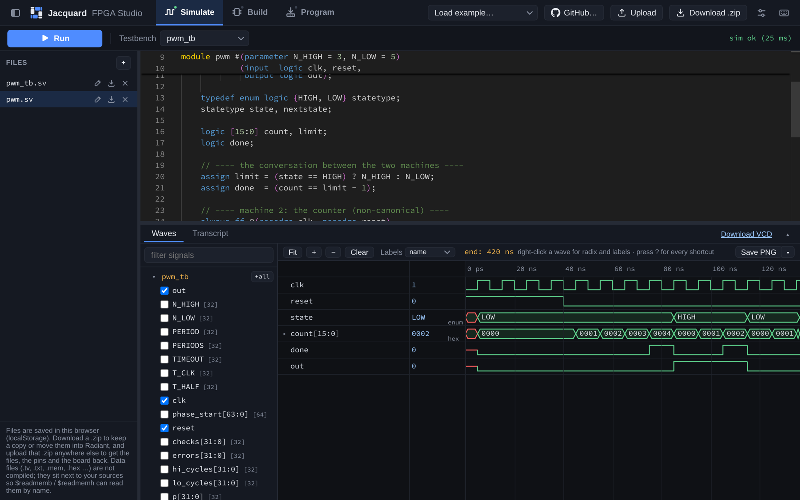
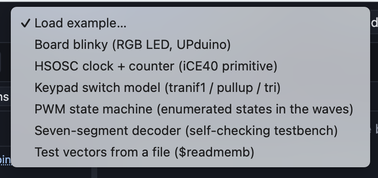
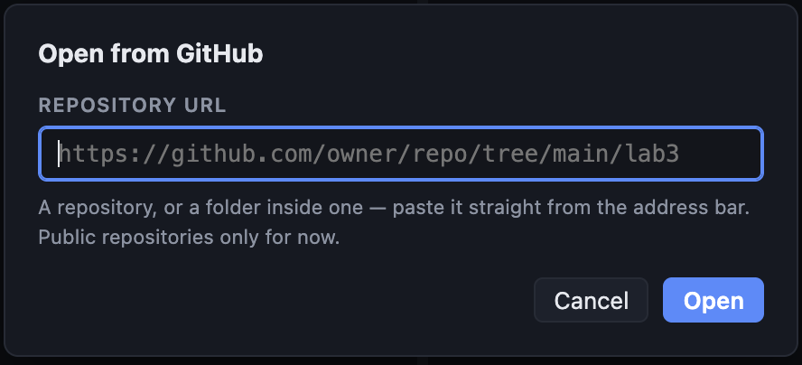
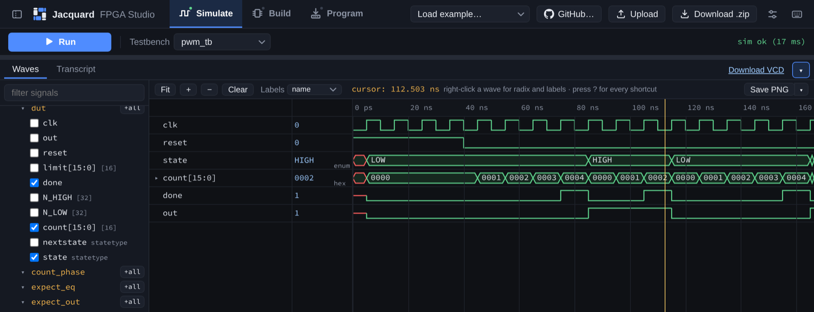
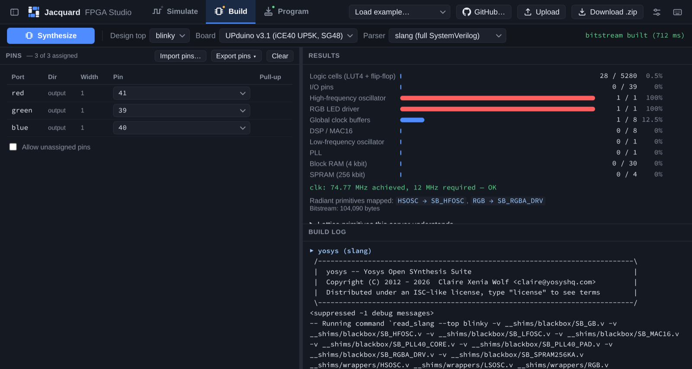
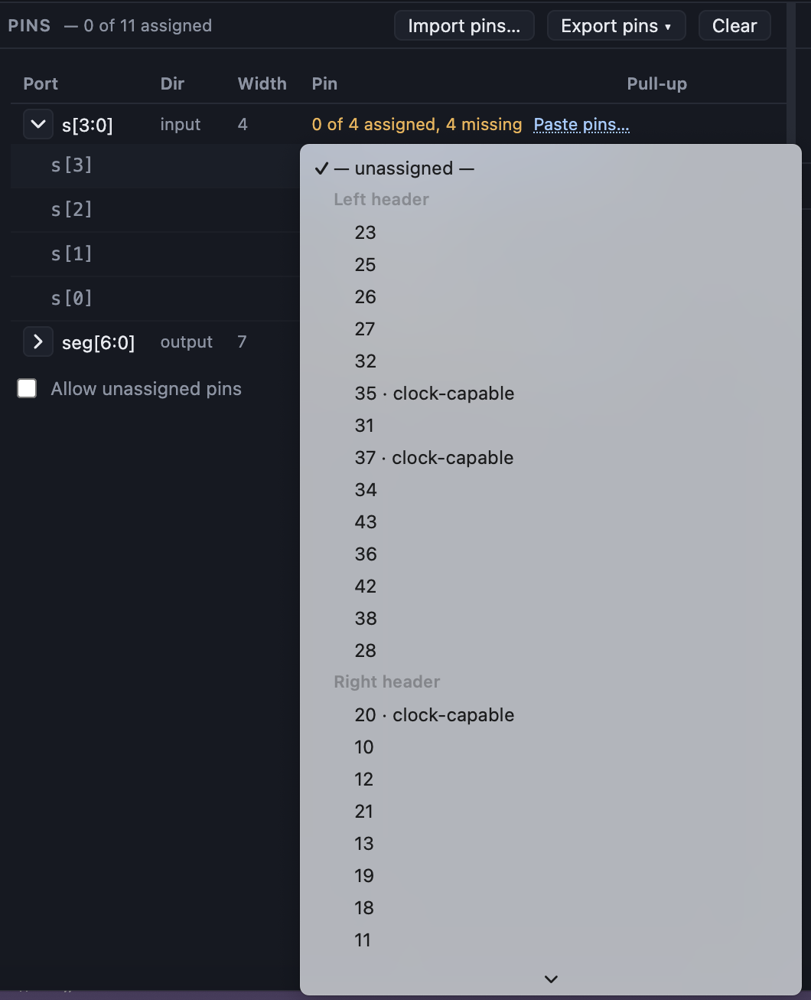
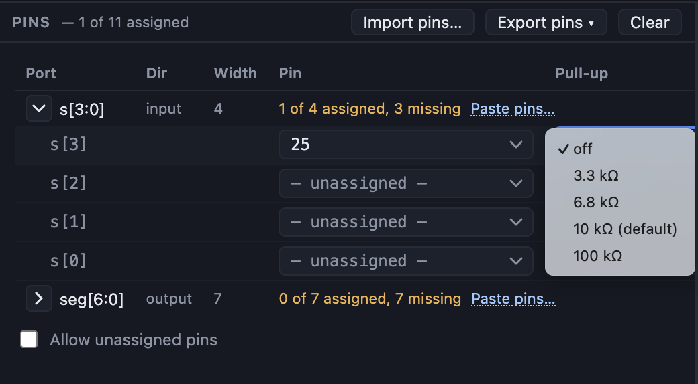
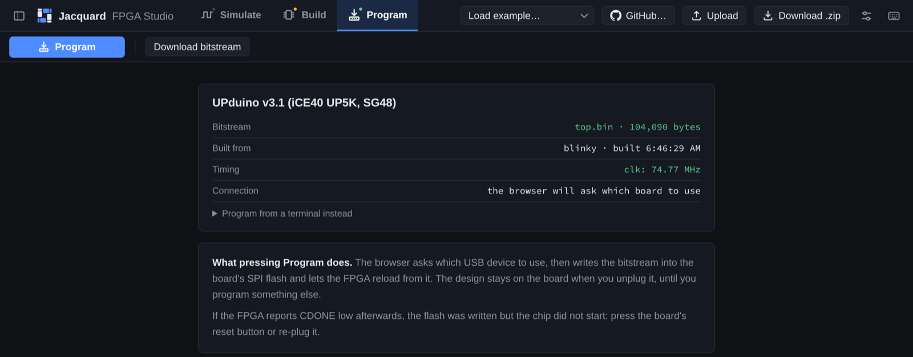

## Introduction

[Jacquard FPGA Studio](https://jacquardfpga.com/) is a browser-based tool for writing, simulating, synthesizing, and programming iCE40 FPGA designs. Everything happens in a browser tab, so there is nothing to install and no license to set up, and it works the same on Mac, Windows, and Chromebooks.

Behind the scenes, Jacquard runs open-source tools on a server: [Icarus Verilog](https://steveicarus.github.io/iverilog/) for simulation, and [yosys](https://yosyshq.net/yosys/) and [nextpnr](https://github.com/YosysHQ/nextpnr) for synthesis and place-and-route. The resulting bitstream is written to your UPduino's flash over USB directly from the browser.

This tutorial covers the full Jacquard workflow: loading files, simulating a testbench, assigning pins, synthesizing, and programming the board.

::: {.callout-note title="Related tutorials"}
Jacquard is an alternative to the Radiant and QuestaSim workflow. The ideas are the same in both tools, so the Radiant tutorials are still worth reading for background:

- [Lattice Radiant iCE40 UltraPlus Project Setup](/tutorials/tutorial-posts/lattice-radiant-ice40-ultraplus-project-setup/) — synthesis, pin assignment, pull-up resistors, and programming.
- [QuestaSim/ModelSim Simulation](/tutorials/tutorial-posts/modelsim-simulation-tutorial/) — writing and running testbenches.
:::

## Getting Started {#getting-started}

Go to [jacquardfpga.com](https://jacquardfpga.com/), click `Log in`, and sign in with your Google account.

To program your board from the browser, you need a browser that supports WebUSB, such as Chrome or Edge. Safari and Firefox do not support WebUSB. You can still simulate and synthesize in them, but you will need to program the board from a terminal (see [Programming from a Terminal](#program-from-terminal)).

### The Jacquard Window {#interface}

Jacquard is split into three screens, selected with the tabs along the top: `Simulate`, `Build`, and `Program`. Each screen has its own controls, but they all work on the same set of files.

The files in your project are listed in the Files panel on the left. Clicking a file opens it in the editor in the middle of the window. The icons next to each file let you rename, download, or delete it, and the `+` button at the top of the panel creates a new file.

The buttons on the right side of the top bar manage the project as a whole: `Load example...`, `GitHub...`, `Upload`, and `Download .zip`. Each of these is covered below.

::: {#fig-jacquard-simulate}

The Jacquard Simulate screen.
:::

::: {.callout-warning title="Save your work"}
Jacquard stores your files in your browser, not on a server. They will still be there if you close the tab, but they will not follow you to another computer or browser, and they will be lost if you clear your browser data. Click `Download .zip` often, and commit your source files to your Git repository as you would with any other project.
:::

## Adding Files {#adding-files}

### Loading an Example {#examples}

Click `Load example...` to open one of the built-in example projects. These are a good way to get familiar with Jacquard before using it on your own code.

::: {#fig-load-example}
{width="60%"}

Built-in example projects.
:::

If this is your first time using Jacquard, start with `Board blinky`. It blinks the RGB LED on the UPduino and goes through simulation, synthesis, and programming, so it is a quick way to check that your browser, cable, and board all work. The `HSOSC clock + counter` example is also worth a look since it uses the same `HSOSC` oscillator you will use in Lab 1.

### Creating and Uploading Files {#uploading}

To start a new file, click `+` at the top of the Files panel and give it a name ending in `.sv`, such as `lab1_xx.sv`.

To bring in files you already have, click `Upload` and select them. Along with SystemVerilog files, you can upload test vector and memory files (`.tv`, `.txt`, `.mem`, `.hex`). These are not compiled. They sit next to your source files so that `$readmemb` or `$readmemh` in your testbench can find them by name.

You can also upload a `.zip` that you previously downloaded from Jacquard. This brings back your source files along with your pin assignments.

### Opening a Project from GitHub {#github}

If your code is already on GitHub, click `GitHub...` and paste the URL of the repository, or of a folder inside it, straight from your browser's address bar. Click `Open` to load the files.

::: {#fig-github-url}
{width="60%"}

Opening a project from GitHub.
:::

**Only public repositories are supported right now.** Your lab repositories are private, so for those you will need to upload your files instead.

Jacquard does not push changes back to GitHub. When you are done, download your files and commit them to your repository from your computer.

## Simulating {#simulating}

On the `Simulate` screen, select your testbench module from the `Testbench` dropdown and click `Run`. When the simulation finishes, `sim ok` appears in the top right along with how long it took.

Any `$display` output from your testbench shows up in the `Transcript` tab, including the pass/fail messages from a self-checking testbench. If your code does not compile, the errors appear here too. Clicking the file and line number in an error jumps to that line in the editor. See [Designing a Good Testbench](/tutorials/tutorial-posts/modelsim-simulation-tutorial/#designing-a-good-testbench) for how to write a testbench that checks itself.

### Reading Waveforms {#waveforms}

The `Waves` tab shows the simulation results as a waveform. The signal list on the left shows every module in your design. Check the box next to a signal to add it to the waveform, or click `+all` to add everything in a module. If you have a lot of signals, the filter box at the top helps you find the one you want.

Use `Fit` to zoom out to the whole simulation, or `+` and `−` to zoom in and out. You can also drag across the time axis to zoom in on a specific window. Clicking in the waveform places a cursor and shows its time in the toolbar.

A few other things that are useful to know:

- Drag signals up and down to rearrange them.
- Click the arrow next to a bus, such as `count[15:0]`, to expand it into individual bits.
- Right-click a signal to change how its value is displayed (hex, binary, decimal, signed, or ASCII).
- Press `?` to see all of the keyboard shortcuts.

Jacquard also reads the names from any `typedef enum` in your code, so state machine states show up by name (for example `HIGH` and `LOW`) instead of as numbers. This makes FSMs much easier to debug.

::: {#fig-jacquard-waves}

The waveform viewer. The `state` signal is an enum, so its values are shown by name.
:::

To include a waveform in your lab report, click `Save PNG` to export the signals currently on screen as an image.

## Building {#building}

The `Build` screen is where you assign pins and synthesize your design. At the top of the screen, set `Design top` to your top-level module (not your testbench) and set `Board` to `UPduino v3.1 (iCE40 UP5K, SG48)`. Leave `Parser` on its default setting.

::: {#fig-jacquard-build}

The Build screen.
:::

### Assigning Pins {#pin-assignment}

As in Radiant, you need to tell Jacquard which physical FPGA pin each input and output should connect to. The `Pins` table lists each port of your top-level module. Unlike Radiant, you do not need to synthesize first for your signals to show up.

Choose a pin number for each port from the dropdown in the `Pin` column. The dropdown groups the pins by which header of the UPduino they are on, and marks the pins that can be used as clock inputs. For a bus like `s[3:0]`, click the arrow to expand it and assign each bit separately.

::: {#fig-pin-assign}
{width="60%"}

Choosing a pin for one bit of a bus.
:::

The table keeps track of how many pins you have assigned, and marks a conflict if you put two signals on the same pin. If any port is left unassigned, the build will fail instead of placing it on a random pin. There is an `Allow unassigned pins` checkbox to override this, but you will rarely need it.

To find the right pin numbers, check the [E155 Development Board Schematic](/assets/doc/E155%20Development%20Board%20Schematic.pdf) and the [Finding the Right Pin Numbers](/tutorials/tutorial-posts/lattice-radiant-ice40-ultraplus-project-setup/#finding-the-right-pin-numbers) section of the Radiant tutorial. The same warnings about pins shared with the MCU apply here.

### Pull-Up Resistors {#pull-up-resistors}

Inputs connected to DIP switches or buttons need a pull-up resistor so that they read a valid logic high when the switch is open. Set this in the `Pull-up` column next to the pin. Any of the options will work, but `10 kΩ` is a good default. See [Configuring Pull-Up Resistors](/tutorials/tutorial-posts/lattice-radiant-ice40-ultraplus-project-setup/#pull-up-resistors) in the Radiant tutorial for more background.

::: {#fig-pin-resistors}
{width="60%"}

Setting a pull-up resistor on an input.
:::

### Importing and Exporting Pins {#import-export-pins}

If you have already assigned your pins in Radiant, click `Import pins...` and select your `.pdc` file instead of entering them again. `Export pins` does the reverse, so you can move a design from Jacquard into Radiant. Your pin assignments are also saved in the `.zip` when you click `Download .zip`.

### Synthesizing {#synthesizing}

Click `Synthesize`. When it finishes, `bitstream built` appears in the top right, and the Results panel shows how much of the FPGA your design uses, such as logic cells, I/O pins, and the oscillator. As with Radiant, check that the number of registers and pins matches what you expect from your design.

Below the resource usage, Jacquard reports the maximum clock frequency your design can run at and whether it meets the clock speed you are using. It also lists any Lattice primitives it converted for the open-source tools. For example, `HSOSC → SB_HFOSC` means your `HSOSC` instance was handled without needing any changes to your code.

If something does not look right, the full synthesis output is in the Build Log at the bottom of the screen.

## Programming {#programming}

Plug in your UPduino and go to the `Program` screen. Before programming, check the summary to make sure the bitstream was built from the design you expect.

Click `Program`. Your browser will ask which USB device to use. Select your UPduino and connect. Jacquard then writes the bitstream to the board's flash memory, and the FPGA reloads and starts running your design. Your design stays on the board after you unplug it, until you program something else.

::: {#fig-jacquard-program}

The Program screen.
:::

If Jacquard reports that CDONE is low after programming, the flash was written but the FPGA did not start up. Press the reset button on the board, or unplug it and plug it back in.

### Programming from a Terminal {#program-from-terminal}

If your browser does not support WebUSB, click `Program from a terminal instead` for a command you can run in your terminal to program the board. You can also click `Download bitstream` to save the `.bin` file and program it with another tool such as [openFPGALoader](/tutorials/tutorial-posts/openfpgaloader-programmer/).

::: {.callout-important title="Working on Lab 1?"}
You have finished this tutorial. Go back to the [Lab 1 tutorial list](/lab/lab1/#part-1-tutorials) and continue.
:::


