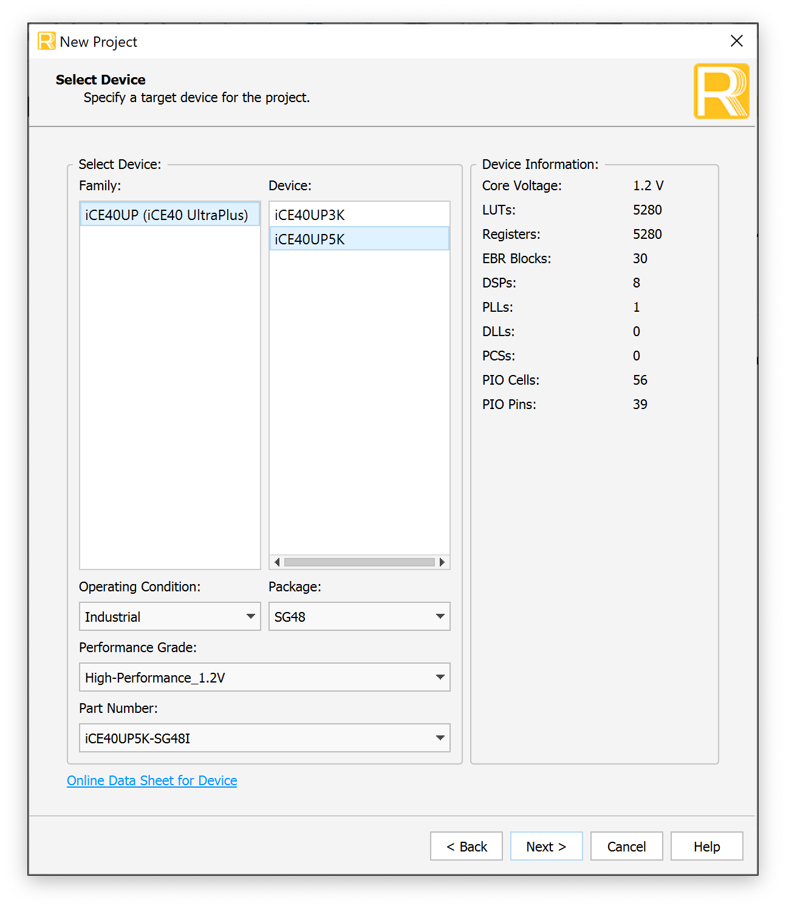
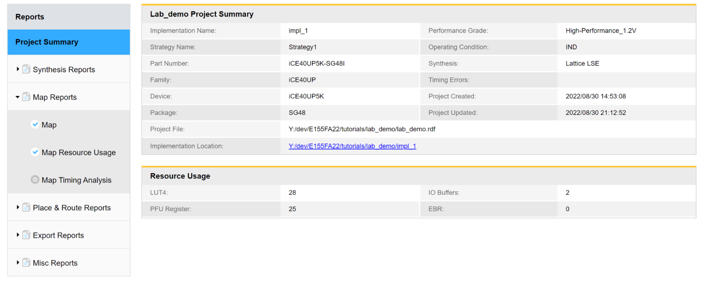
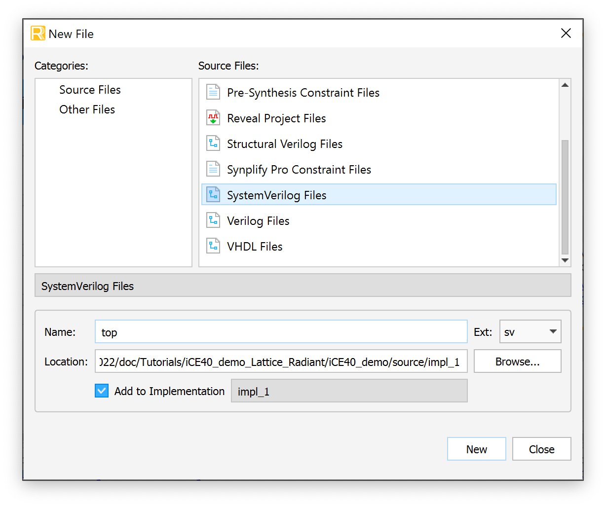
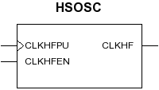
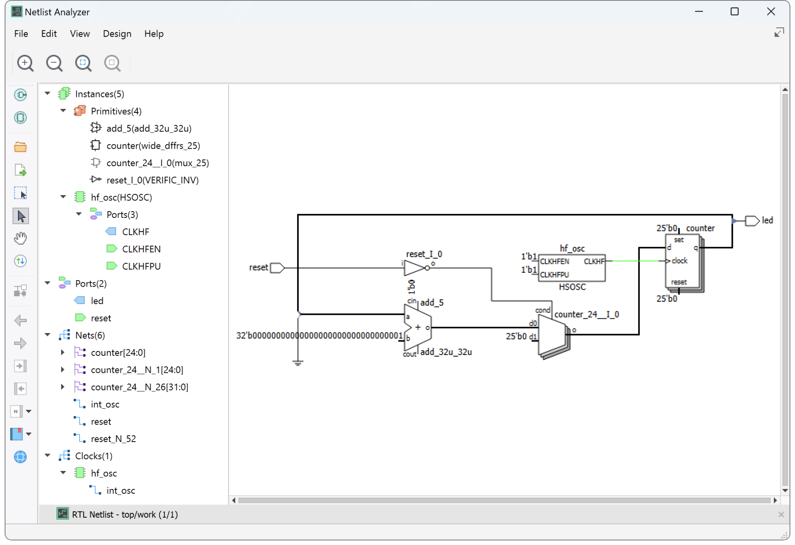
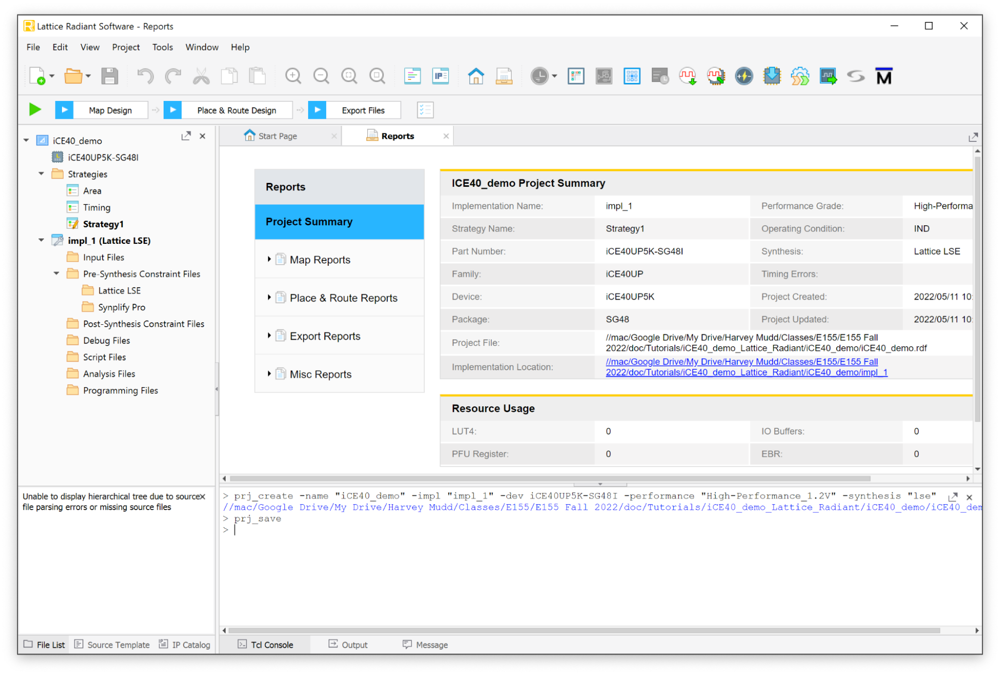
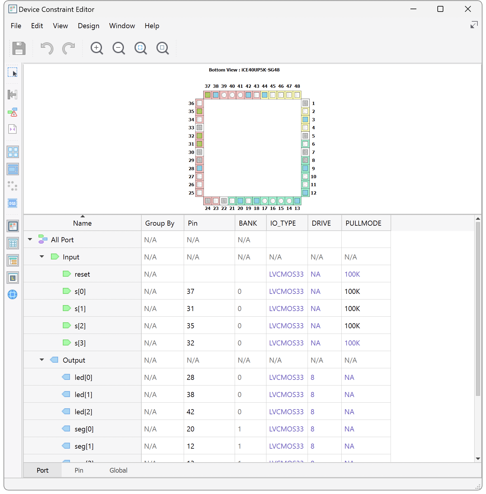
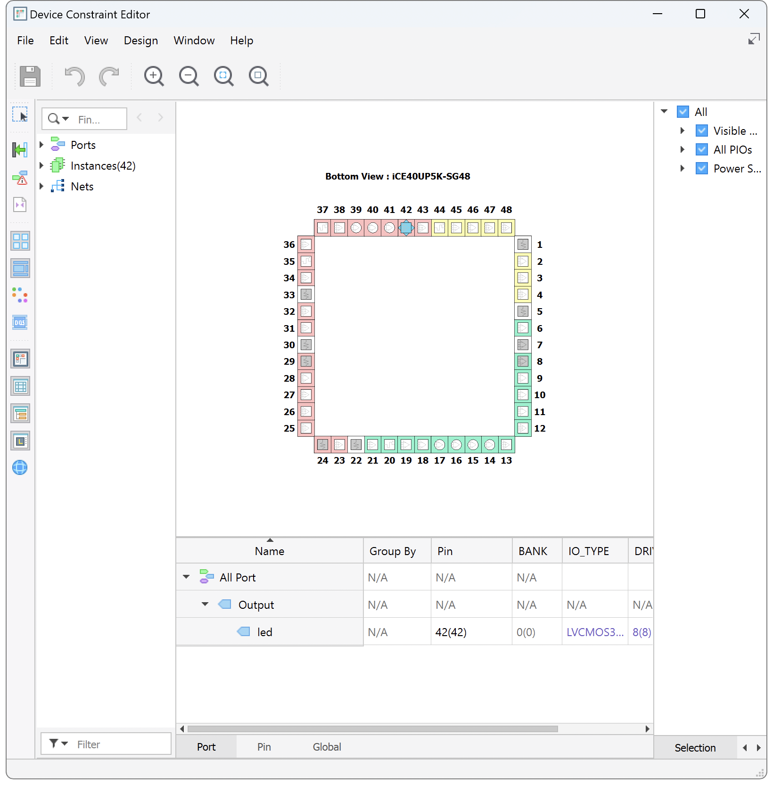
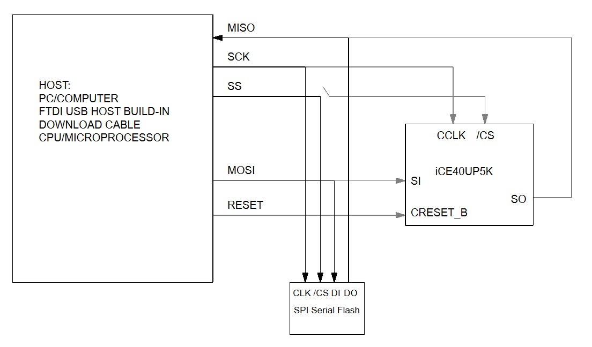
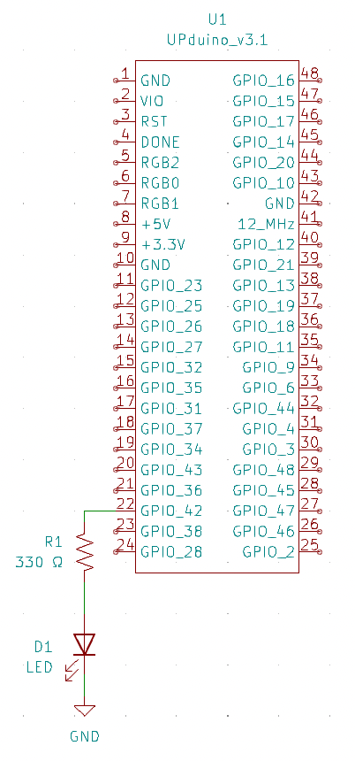

## Introduction

This tutorial covers the complete Lattice Radiant workflow for the iCE40 UltraPlus: creating a project, writing a design, synthesizing it, assigning pins, and programming the FPGA.

It uses a small demo design that blinks the onboard LED at \~1 Hz so you have something concrete to run. If you are working on a lab, use the demo to learn the tool flow, then apply the same steps to your own design.

::: {.callout-note title="Related tutorials"}
Two closely related topics live on their own pages:

- [Lattice Radiant Installation](/tutorials/tutorial-posts/lattice-radiant-installation/) — downloading, installing, and licensing Radiant. Do this first if you have not installed the tools.
- [QuestaSim/ModelSim Simulation](/tutorials/tutorial-posts/modelsim-simulation-tutorial/) — simulating your design before you commit it to hardware.
:::

::: {.callout-tip title="Working on Lab 1?"}
Lab 1 sends you to this page at four points. Each section ends with a callout telling you when to head back to the lab.

1. [Project Setup](#project-setup) — create your Radiant project.
2. [Pin Assignment](#pin-assignment) — map your signals to physical pins.
3. [Synthesizing the Design](#synthesizing-the-design) — generate the configuration file.
4. [Programming the Device](#programming-the-device) — load your design onto the board.
:::

## Project Setup {#project-setup}

Open Lattice Radiant. If you are prompted for a license file, navigate to it. See the [Lattice Radiant Installation](/tutorials/tutorial-posts/lattice-radiant-installation/) instructions if needed.

Create a new project and name it "iCE40_demo". Select the project location in the directory you wish.
**Make sure that the path does not include spaces since this often leads to errors later in the synthesis process.**
You do not need to add any existing HDL files to the project.

In the "Select Device" menu, select the `iCE40UP5K` and the `SG48` package. On the next page, select `Lattice LSE` as the synthesis tool.

::: {#fig-new-project-device}


New project setup.
:::

After the new project wizard completes, you will be presented with the following default screen.

::: {#fig-project-summary}


New project summary.
:::

### Creating a Source File

Navigate to `File > New > New File` and select `SystemVerilog Files` in the New File selection window. Name your file and click `New` to create it.

::: {#fig-create-file}


Create new file.
:::

::: {.callout-important title="Working on Lab 1? Return to the lab now"}
You now have a project set up for the UP5K.
Go back to [Lab 1 → Design and Synthesis in Radiant](/lab/lab1/#design-and-synthesis-in-radiant) and create your own `lab1_xx.sv` source file instead of the demo below.
Lab 1 will send you back here to assign pins, synthesize, and program.
:::

## Implementing the Demo Design in SystemVerilog

In this demo we will write HDL to blink the onboard LED at \~1 Hz.

To do this, we will use the on-board iCE40 high-frequency oscillator to generate the clock signal and build a simple counter which will toggle at the desired frequency.

```
module top(
     input   logic reset,
     output  logic led
);

   logic int_osc;
   logic [24:0] counter;

   // Internal high-speed oscillator
   HSOSC #(.CLKHF_DIV(2'b01))
         hf_osc (.CLKHFPU(1'b1), .CLKHFEN(1'b1), .CLKHF(int_osc));

   // Counter
   always_ff @(posedge int_osc) begin
     if(reset == 0)  counter <= 0;
     else            counter <= counter + 1;
   end

   // Assign LED output
   assign led = counter[24];

endmodule
```

Note that we configure our reset to be active low (reset when 0 or connected to ground) since we have internal pullup resistors which make it easy to pull the pin high but not internal pulldown resistors.

In this design we use the HSOSC module, the high-speed oscillator available on the iCE40UP5K chip. The HSOSC module is a Verilog library provided with the iCE40 device support package in Radiant.
You can find more information about the oscillator under `Help > Lattice Radiant Software Help > Reference Guides > FPGA Libraries Reference Guide > Primitive Library - iCE40UP (iCE40 UltraPlus)`.
Here, as an example of how to infer a module with parameters in Verilog, we instantiate it with the optional parameter `CLKHF_DIV` which sets the output frequency to 24 MHz.

::: {#fig-hsosc}


High-speed oscillator block diagram.
:::

## Synthesizing the Design {#synthesizing-the-design}

Synthesis turns your HDL into a programming file that can be transferred onto the FPGA. It outputs a binary file (`.bin`) in your project directory that is used to program the FPGA over JTAG using the onboard USB programmer.

Be sure your SystemVerilog files are saved, then click the green "Play" triangle to start the synthesis process.

To help sort the many messages that the compilation process generates, click a tab under the Message area to see only that type of message. If compilation is successful but generates warnings, check the Warning and Error tabs for errors relevant to your design.
Warnings about incomplete I/O assignments may be ignored if you have in fact assigned all relevant I/O pins.

### Netlist Analyzer

After synthesizing your design, it is worth taking a look at the Netlist Analyzer. This tool provides a block diagram view of the design and shows the logic that was synthesized from your Verilog.
This is a helpful tool to make sure that the Verilog you wrote is implying the hardware that you intend.
**Remember that as a digital designer you should always think about the underlying hardware and simply write the Verilog idioms to imply it.**
Approach HDL like a traditional programming language at your peril!

Open it under `Tools > Netlist Analyzer` or the green and black icon in the toolbar.
For the demo design we see that we have implied an adder, a mux to control the value to the registers, the HSOSC module, and a 25-bit-wide register.

::: {#fig-netlist-analyzer}


Netlist analyzer window.
:::

### Resource Usage

There is also useful information in the Reports tab under Project Summary in the Resource Usage section. This section shows the number of registers, look-up tables, IO buffers, and embedded RAM blocks (EBRs) implied by your design.
For the demo design, we have 25 registers for storing the current count. An additional 3 logic cells are needed for their LUT4s to provide the additional logic (adder, mux, inverter).

Check that the total number of registers and pins matches your expectations. Under Analysis & Synthesis, you can see how the logic blocks and registers are broken down in each module. Under Fitter, the Pin-Out File should match the pin assignments you intended.

::: {#fig-resource-usage}


Resource usage report.
:::

::: {.callout-important title="Working on Lab 1? Return to the lab now"}
Your design is synthesized and you have a `.bin` configuration file.
Go back to [Lab 1 → Generating the FPGA Configuration Files](/lab/lab1/#generating-the-fpga-configuration-files), then continue on to program your board.
:::

## Pin Assignment {#pin-assignment}

When you first synthesize a design, Radiant assigns the inputs and outputs of your top-level module to I/O pins arbitrarily. Before your design will work on real hardware, you need to tell Radiant which physical pin on the FPGA each signal in your Verilog should be routed to.

::: {.callout-note}
You need a synthesized project before the Device Constraint Editor will list your signals. If you have not synthesized yet, work through [Synthesizing the Design](#synthesizing-the-design) first.
:::

### Assigning Pins in the Device Constraint Editor

Launch `Tools → Device Constraint Editor`. A table listing all inputs and outputs for the project should appear. Under the `Pin` column, type the pin number to associate with the given signal.

::: {#fig-pin-radiant-assignment}


Radiant pin assignments.
:::

The currently routed pin is shown in parentheses next to the pin you request. For example, if you request pin 42 but the design is presently routed to pin 36, you will see `42(36)`.

To actually move the signal, resynthesize the design by clicking the green play button. The first time you do this, Radiant asks you to save a `.pdc` (pin device constraint) file — name and save it in your project directory.
After synthesis completes, reopen the Device Constraint Editor and confirm the requested and routed pins match, e.g. `42(42)`.

### Finding the Right Pin Numbers

The FPGA pinouts are shown in the Board Schematic. Most of the user input/output (I/O) pins are tapped out to the headers and labeled on the board silk screen. Some have special functions; for example, FPGA pin P42 is connected to LED D6.

The pin numbers for the LEDs and switches are marked on the board's silkscreen.

::: {#fig-pinout}


Pinout diagram.
:::

::: {.callout-warning title="Check for pin conflicts"}
Some pins are shared between the FPGA and the MCU, and some have dedicated functions on the Nucleo board. Before you commit to a pin, make sure it is not already being used for another purpose.
:::

### Configuring Pull-Up Resistors {#pull-up-resistors}

The Device Constraint Editor is also where you configure the internal pull-up resistors for the I/O pins. Find the `PULLMODE` column for the pin you want to configure and set it to the desired pull-up value.

Inputs driven by DIP switches need pull-ups. A switch typically connects the pin to ground when closed and leaves it floating when open, and a floating input has no defined logic level. The pull-up resistor pulls the pin to a valid logic high whenever the switch is open.
The exact value is not very important — anything between 10 kΩ and 100 kΩ is generally sufficient.

Note that the iCE40 provides internal pull-*up* resistors but not internal pull-*down* resistors. This is why active-low resets and switch inputs are the conventional choice on this chip.

### Demo Example: Routing the LED to GPIO 42

For the demo design, we will route the `led` output to GPIO 42. Open the Device Constraint Editor, select the table entry in the "Pin" column associated with the `led` signal, and enter "42".
You will notice that the currently routed pin is labeled in parentheses, 36 in this example.
Resynthesize the design, save the `.pdc` file when prompted, and confirm you see "42(42)" in the table entry corresponding to the `led` output.

::: {.callout-important title="Working on Lab 1? Return to the lab now"}
That covers everything you need for pin assignment in Lab 1.
Go back to [Lab 1 → Pin Assignment](/lab/lab1/#pin-assignment) and continue with the Seven Segment Display Circuit.
:::

## Programming the Device {#programming-the-device}

To get our design working on our board, we need to program it to the flash memory onboard the UPduino board.

Each time the FPGA powers up or resets, it reconfigures itself over a serial peripheral interface (SPI) connection from a binary (`.bin`) configuration file on a flash memory chip.

To program the device, we need to set up the programmer to put the `.bin` file generated by our synthesis tool onto the flash chip.

Click the button in the toolbar to open the programmer (the icon is the chip with a blue arrow pointing downward) or use the menu `Tools > Programmer`.

Connect your UPduino board to your computer and click the "Detect Cable" button in the "Cable Setup" sub-window on the right of the Programmer window.
You should see a message noting that "INFO - Board with FTDI USB Host Chip detected." in the output window.
If the host chip is not detected, you may need to install FTDI drivers for the device.
However, some devices with drivers installed will still report an FTDI error.
Sometimes you need to change the dropdown menu away from "FTDI" and then hit detect cable again if your UPduino is not being recognized (try this if your device appears as "Generic JTAG Device").
Sometimes double clicking on the generic JTAG device will allow you to access drop down menus and set the device settings.

Next we need to correctly configure the programming toolchain. By default, the UPduino board only enables programming of the flash chip on board and not the onboard compressed random access memory (CRAM) of the FPGA itself.
To change this, highlight the device in the list view and open the "Device Properties" window either by using the icon in the toolbar (chip with pencil on top) or by right-clicking on the entry in the table and selecting the "Device Properties" option.

Change the default entries to the following selections:

-   Set Target Memory to `External SPI Flash Memory`
-   Set operation to `Erase, Program, Verify`
-   Under SPI Flash Options set
    -   Family: `SPI Serial Flash`
    -   Vendor: `WinBond`
    -   Device: `W25Q32JV`
    -   Package: `208mil 8-pin SOIC`

After configuration, the block diagram should look like this.

{#fig-flash-programming}

After updating the configuration, you are ready to program the device.
(Note: on your first run, you may get a firewall warning that a new program "cableserver" is being run and needs access. Allow access to the program.)

You should see a series of outputs printing in the output window as the programmer cycles through the various pieces of the programming process (initialization, enabling, erasing, programming, verifying, etc.).
After the programming finishes, you should see a message that the programming operation was successful.

### Troubleshooting {#troubleshooting}

If you are seeing issues with specific pins on your FPGA there could be a few different reasons and corresponding steps to take to troubleshoot.

- You could have an electrical short which is causing some pins to be electrically connected that should not be, due to solder bridges. Double check that the pins are isolated and not connected together by checking the resistance between the pins with a multimeter.
- You are trying to use a pin that is shared between the FPGA and the MCU, and the MCU is not leaving that pin floating or it is driving it as an output. You can get around this by wiping the code on the MCU by uploading a file with a blank main function.
- You should also read through the Nucleo board documentation to see what pins have special functions that are used by default by the MCU. Hint: You likely want to stay away from using the pins that the MCU uses for serial communication by default.

::: {.callout-important title="Working on Lab 1? Return to the lab now"}
Your design is now programmed onto the board.
Go back to [Lab 1 → Program and Test Your Design](/lab/lab1/#program-and-test-your-design) and finish the lab.
The section below is an extra hardware check for the demo design and is not part of Lab 1.
:::

## Testing the Demo in Hardware

{#fig-led-blink fig-align="center" width="50%"}

If you are using the E155 development board, you should see the onboard LED connected to P42 blinking.
If you would like to test the hardware separately with just the UPduino, you can unplug the USB from your board and connect your UPduino board to a breadboard, wiring up an LED in series with a current limiting resistor (typically a value between 330 Ω and 1 kΩ is a good choice).
Then, reconnect your board to power via USB or using the +5V input on the board from a DC power supply.


