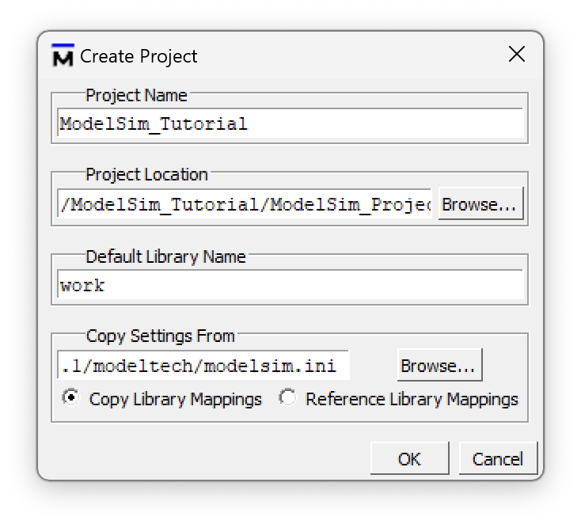
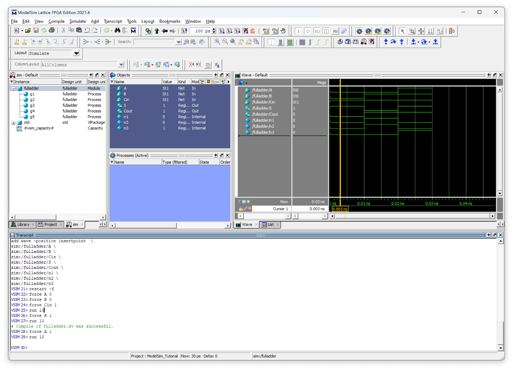
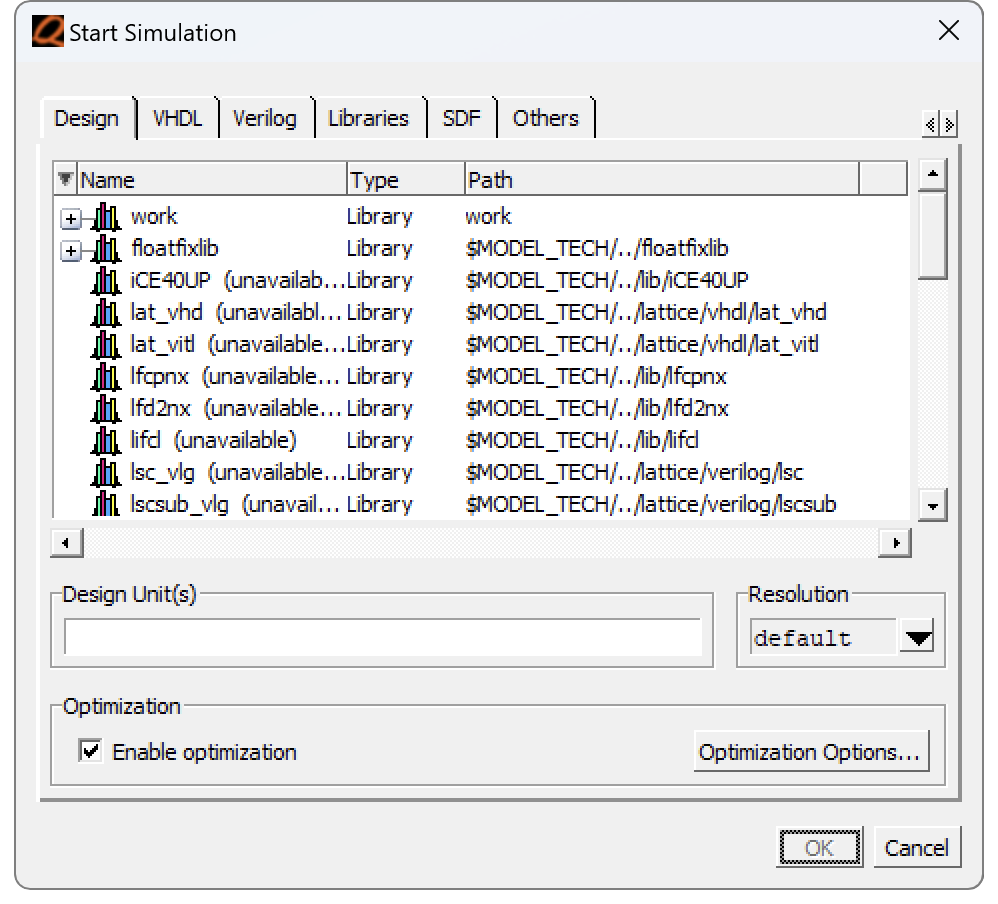
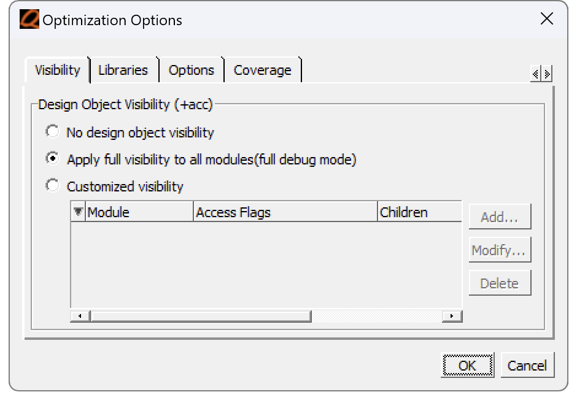
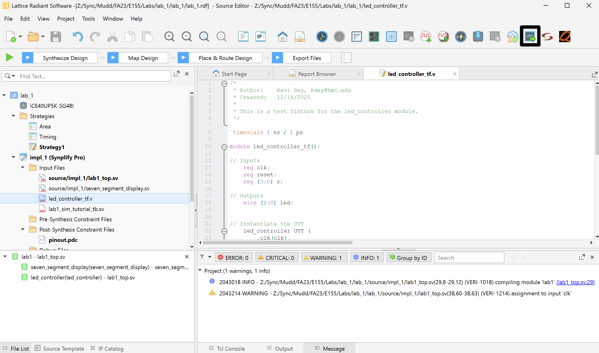
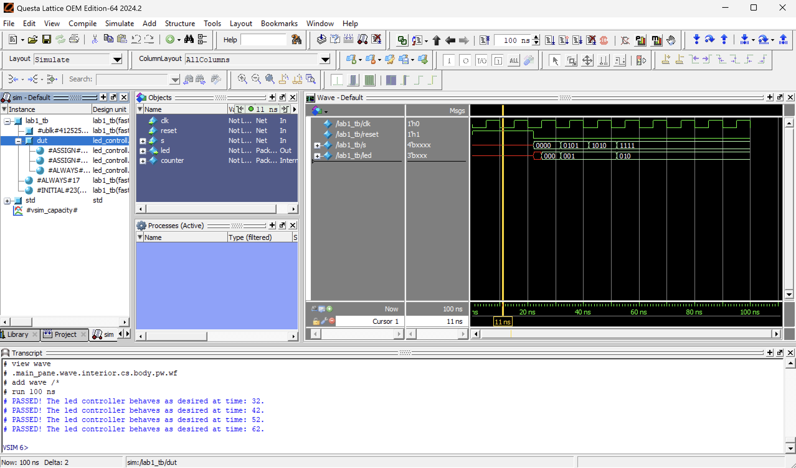
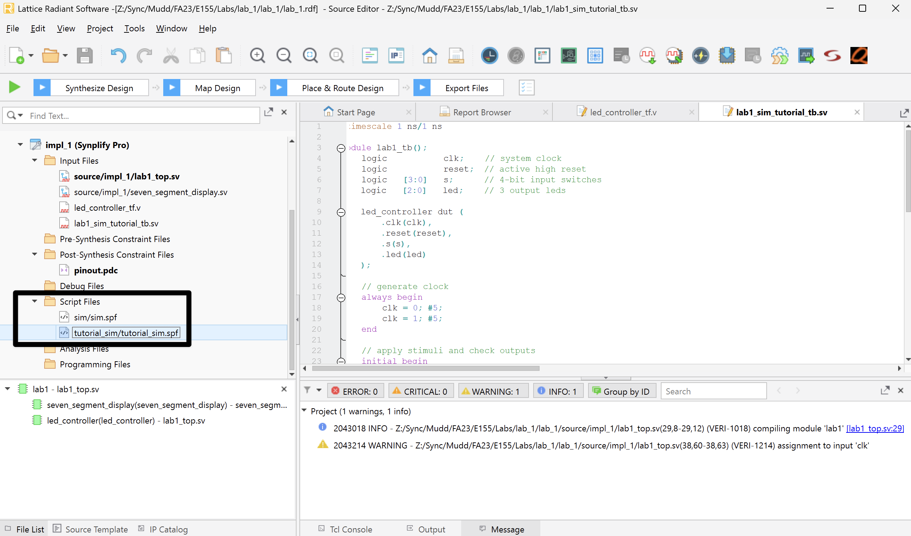
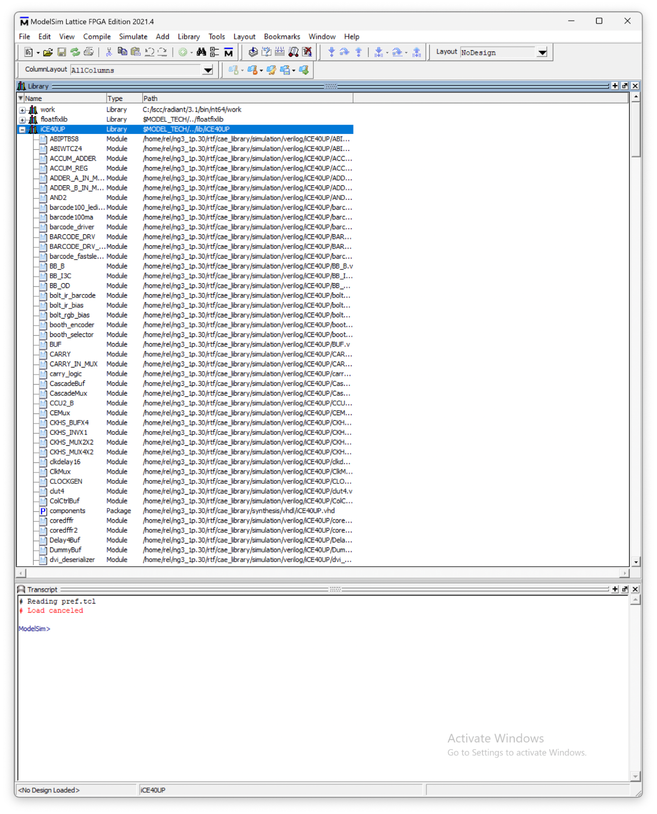
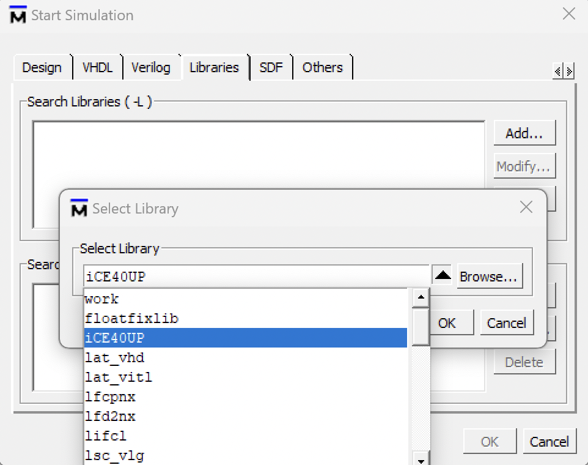
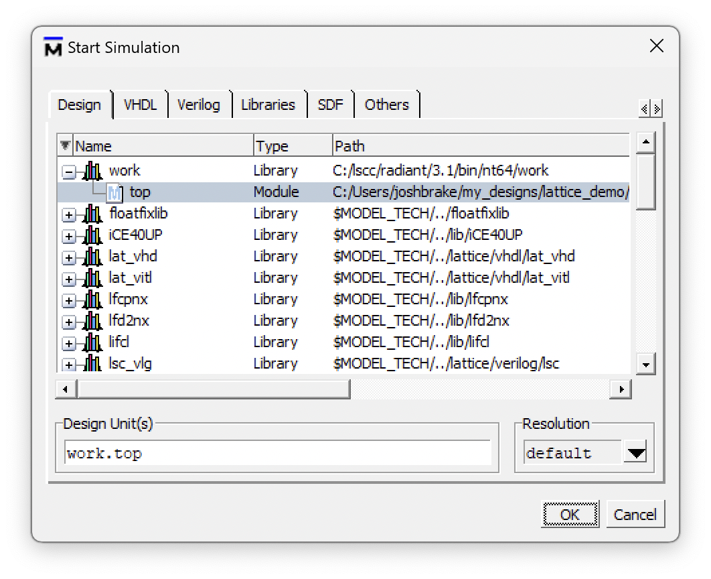

::: {.callout-warning title="QuestaSim is ModelSim"}
ModelSim was renamed to QuestaSim as part of Mentor Graphics' (now Siemens EDA) strategy to unify and rebrand their simulation tools under the "Questa" umbrella.
Across the web and on this website you may see references to both QuestaSim and ModelSim, but both names refer to the same software tool.
:::

## Introduction

To verify that designs are working, it is useful to simulate them before putting them on hardware.
This tutorial covers three ways to drive a simulation, from quickest to most rigorous:

1. [Forcing signals by hand](#forcing-signals) — fastest way to sanity-check a small design.
2. [Writing a testbench](#testbench-simulation) — automatic, repeatable checking.
3. [Launching from the Simulation Wizard](#launching-questa) — the fastest way to run a testbench you have already written.

It also covers [including the iCE40 technology library](#libraries), which you need whenever your design instantiates a Lattice primitive such as `HSOSC`.

## Opening ModelSim from Radiant

Open ModelSim from Radiant using the `Tools → QuestaSim Lattice Edition` menu or the icon in the toolbar.
The ModelSim window will open.

Get in the habit of watching the transcript window to look for errors and to familiarize yourself with what a good run looks like.
If you see errors, close ModelSim, correct your Verilog code in Radiant, and reopen ModelSim.
You can also edit the file directly in ModelSim and recompile there without going through the entire synthesis pipeline in Radiant.

::: {.callout-note title="Designs using the iCE40 Technology Library"}
Some of your designs may include modules from the iCE40 Technology Library (e.g., the `HSOSC` module used to generate a clock signal).
If you simulate a design including one of these modules, you must include the library or ModelSim will not find the design unit.
See [Including the iCE40 Technology Library](#libraries) below before you start the simulation.
:::

### Starting a Simulation

In QuestaSim/ModelSim, simulate your module by choosing `Simulate → Start Simulation...`.
Click on the `+` symbol next to the work library and select the module you want to simulate.

If the wave pane isn't open, open it by choosing `View → Wave`.
View all of the inputs and outputs of your design by selecting them in the Objects window and dragging them into the Wave window.
In a more complicated design, you may wish to examine internal signals as well.

## Simple Simulations by Forcing Signals {#forcing-signals}

If you have a simple design and want to quickly check that it is working, you can use the `force` command in the ModelSim transcript window to apply test inputs, then advance time with `run`.

For example, to step a 4-bit input `s` through its first few values:

```
force s 0000
run 100
force s 0001
run 100
force s 0010
run 100
...
```

::: {.callout-tip title="Watch out for optimization"}
If you're not seeing all the signals in your design, it's possible that QuestaSim optimized them away.
See [Preventing Optimization](#preventing-optimization) below to fix this.
:::

### Full Adder Example

Let's walk through a complete example using a full adder circuit.

::: {#fig-full-adder-schematic}
{width=50%}

Full adder schematic.
:::

Open ModelSim and create a new ModelSim project titled `ModelSim_Tutorial`, saved in a location where the path name has no spaces.
Then create a new file named `fulladder.sv`, making sure the file type is SystemVerilog.
Add the Verilog code below to create a structural Verilog model of the full adder circuit shown above.

::: {#fig-new-project}
{width=50%}

Create new project.
:::

```
// fulladder.sv
// Structural Verilog full adder
// 5/26/22
// Josh Brake
// jbrake@hmc.edu

module fulladder(
 input   logic A, B, Cin,
 output  logic S, Cout
);

 logic n1, n2, n3;

 xor g1(n1, A, B);
 xor g2(S, n1, Cin);

 and g3(n2, n1, Cin);
 and g4(n3, A, B);

 or  g5(Cout, n2, n3);

endmodule
```

Compile your file via the `Compile` menu, then start the simulation using `Simulate → Start Simulation...`.
You will see the GUI change and open up the Objects and Wave panes.
You can always toggle windows on or off as desired using the View toolbar menu.

Add the signals you care about by selecting them in the Objects pane and dragging them into the Wave pane.
The inputs start floating (HiZ), so initialize them with `force <Signal Name> <Signal Value>` in the Transcript pane.
Force `A`, `B`, and `Cin` to some values of your choosing and then run the simulation for 10 time units by typing `run 10`.
The Wave window will advance the appropriate number of time points, displaying the values of the signals.

::: {#fig-sim-waves-force}


Running simulation by forcing signals.
:::

Fill out a truth table for a full adder by evaluating the circuit schematic shown above for all combinations of `A`, `B`, and `Cin`, and verify a few values by forcing them to get the hang of it.

::: {.callout-important title="Working on Lab 1? Return to the lab now"}
You now know enough to bring up your Lab 1 design in simulation and check the `led` and `seg` outputs by hand.
Go back to [Lab 1 → Logic Simulation in ModelSim](/lab/lab1/#logic-simulation-in-modelsim) and continue there.
Lab 1 will send you back to the [testbench](#testbench-simulation) and [Simulation Wizard](#launching-questa) sections below once you have written your testbench.
:::

## Testbench Simulation {#testbench-simulation}

After testing only two or three different inputs by manually forcing values, you are probably already frustrated with how tedious this is.
There is a much more efficient way to run simulations: testbenches.

A testbench is a separate module which generates simulated inputs and enables the generated output signals to be traced versus time.
You've likely seen testbenches before (e.g., in E85) but you may have never written one from scratch by yourself.
While this is a bit daunting at first, the basic architecture of a testbench is straightforward.
Before you proceed, you should review the HDL testbench section in *Digital Design and Computer Architecture* (Section 4.9 in the ARM edition), which covers several different styles of testbenches.

Note that testbenches include Verilog statements that are non-synthesizable (in other words, they cannot be mapped onto hardware).
One example is the `initial` block, which runs only once at the start of a simulation.
In this sense, testbenches use SystemVerilog a bit like a scripting language to enable designs to be easily tested and verified.

A testbench is composed of the following elements:

- Create and initialize the signals for the inputs, outputs, and internal signals of your modules.
- Instantiate the device under test (DUT).
- Generate a simulated clock signal. Even if your module is purely combinational, you will need this clock signal to control when the input test vectors are applied and the outputs checked.
- Load the test vectors and initialize the signals for the simulation (e.g., pulsing the reset line).
- Apply the inputs and check the resulting outputs using the test vectors. One simple way to do this is to apply the test vector on the rising edge of the clock and then check the outputs against the expected outputs on the falling edge of the clock.

Every HDL module that you write should have a testbench to accompany it.
While this will cost you some time up front, it will save you loads of time and potential head injuries from banging your head against the wall wondering why your circuit is not working as you expect.

In this example we will create a testbench with automatic checking against a test vector file.
This is the most powerful type of testbench and will be a good foundation for all the testbenches you will write for this class.

::: {.callout-note title="Two testbench styles"}
This tutorial demonstrates the **test vector** style, where inputs and expected outputs are read from a `.tv` file.
Lab 1 asks you to write a **stim/assert** style testbench instead, where the stimulus and the expected values are written directly in the testbench using `assert` statements.
Both styles run in the simulator exactly the same way — only the source of the expected values differs.
The test vector style shines when you have many cases of the same shape; stim/assert shines for sequential logic like an FSM or clock divider.
:::

### Creating the Testbench

Create a new SystemVerilog file `fulladder_tb.sv` and add it to your project.
Then type the following code into the testbench.

```
`timescale 1ns/1ns
`default_nettype none
`define N_TV 8

module fulladder_tb();
 // Set up test signals
 logic clk, reset;
 logic a, b, cin, s, cout, s_expected, cout_expected;
 logic [31:0] vectornum, errors;
 logic [10:0] testvectors[10000:0]; // Vectors of format s[3:0]_seg[6:0]

 // Instantiate the device under test
 fulladder dut(.A(a), .B(b), .Cin(cin), .S(s), .Cout(cout));

 // Generate clock signal with a period of 10 timesteps.
 always
   begin
     clk = 1; #5;
     clk = 0; #5;
   end

 // At the start of the simulation:
 //  - Load the testvectors
 //  - Pulse the reset line (if applicable)
 initial
   begin
     $readmemb("fulladder_testvectors.tv", testvectors, 0, `N_TV - 1);
     vectornum = 0; errors = 0;
     reset = 1; #27; reset = 0;
   end
  // Apply test vector on the rising edge of clk
 always @(posedge clk)
   begin
       #1; {a, b, cin, s_expected, cout_expected} = testvectors[vectornum];
   end
  initial
 begin
   // Create dumpfile for signals
   $dumpfile("fulladder_tb.vcd");
   $dumpvars(0, fulladder_tb);
 end
  // Check results on the falling edge of clk
 always @(negedge clk)
   begin
     if (~reset) // skip during reset
       begin
         if (cout != cout_expected || s != s_expected)
           begin
             $display("Error: inputs: a=%b, b=%b, cin=%b", a, b, cin);
             $display(" outputs: s=%b (%b expected), cout=%b (%b expected)", s, s_expected, cout, cout_expected);
             errors = errors + 1;
           end


       vectornum = vectornum + 1;

       if (testvectors[vectornum] === 11'bx)
         begin
           $display("%d tests completed with %d errors.", vectornum, errors);
           $finish;
         end
     end
   end
endmodule
```

::: {.hint-box}
**Note**: Functions preceded by a dollar sign (e.g., `$readmemb`, `$display`, `$finish`, etc.) are system functions.
:::

### The Testvector (.tv) File

The test vector file is a plaintext file with a single test vector on each line.
Typically these are organized in the format &lt;inputs>_&lt;expected_outputs> (underscores are ignored but help to provide visual organization) but the specific format is up to you.
You just need to make sure to assign the bits properly in your testbench module.

```
// fulladder_testvectors.tv
// Josh Brake
// jbrake@hmc.edu
// 5/26/22
//
// 5-bit vectors in binary.
// underscore is ignored
// // indicates comment
// a b cin _ s cout
000_00
001_10
010_10
011_01
100_10
101_01
110_01
111_11
```

### Preventing Optimization {#preventing-optimization}

When we simulate a testbench, we need to disable some of the default optimization.
If you don't, QuestaSim will eliminate many of your testbench signals because they are not directly linked to inputs or outputs of the modules.

To prevent optimization, change the optimization settings when you click the `Start Simulation` option from the `Simulate` menu.
Click `Optimization Settings` and then select the option to "Apply full visibility to all modules (full debug mode)".

::: {#fig-optimization-settings layout-ncol=2}





QuestaSim optimization settings for preserving testbench signals.
:::

## Launching Questa from the Simulation Wizard {#launching-questa}

Once you have a testbench written and added to your Radiant project, the quickest way to run it is the Simulation Wizard, launched from the button shown below.

::: {#fig-simulation-wizard}



Button to launch the Questa Simulation Wizard.
:::

Follow the instructions in the wizard to name and create the simulation.
The default settings are good, but make sure to select **your** testbench module name as the `Simulation Top Module` (for Lab 1 that would be `lab1_tb`).

Once you finish, Questa will automatically open and run your simulation.
By default it only runs for 100 ns, so if your simulation takes longer you may need to use the `run` command described in the [forcing signals](#forcing-signals) section.
In the example below, all of the tests passed, as reported in the `Transcript` pane at the bottom.

::: {#fig-questa-sim}



Example Questa simulation.
:::

By default, only signals in your testbench are displayed.
You can add more by selecting `dut` in the instance pane, dragging signals from `Objects` into `Wave`, and then restarting the simulation by running `restart -f` followed by `run 100`.

If you edit the testbench or module code, you can update the simulator by clicking `Compile → Compile All`, or by closing and re-opening the simulation.
If you aren't changing simulation settings, you can re-open a previous simulation from Radiant by double clicking on the simulation name in the `Script Files` folder.

::: {#fig-restart-simulation}



Restart an existing simulation.
:::

::: {.callout-important title="Working on Lab 1? Return to the lab now"}
Your testbench is now running in Questa.
Go back to [Lab 1 → Pin Assignment](/lab/lab1/#pin-assignment) and continue with the rest of the lab.
The section below on technology libraries is a reference you will need if your design instantiates `HSOSC`.
:::

## Including the iCE40 Technology Library {#libraries}

In many instances we want to leverage the iCE40 Technology Library.
However, when we simulate these designs, we need to include the appropriate libraries so that ModelSim can find the correct design units.

When you install Lattice Radiant with ModelSim Lattice FPGA Edition, it comes with a set of installed libraries.
For our purposes, we are most interested in the iCE40UP library.

To include it, start the simulation by clicking `Simulate > Start Simulation`.
Then navigate to the Libraries tab and add `iCE40UP` to the Search Libraries window using the "Add…" button.

::: {#fig-ice40-tech-library}
{width=50%}

iCE40 technology library.
:::

::: {#fig-ice40-add-library}
{width=50%}

Add the iCE40 technology library.
:::

Then navigate to the "Design" tab, select your top-level module, and click OK.
Your simulation should now start and open up the Wave window.

::: {#fig-ice40-start-sim}
{width=50%}

Start simulation of the `top` module with the library loaded.
:::

Note that you can also achieve the steps above by running `vsim work.top -L iCE40UP` in the command window.


