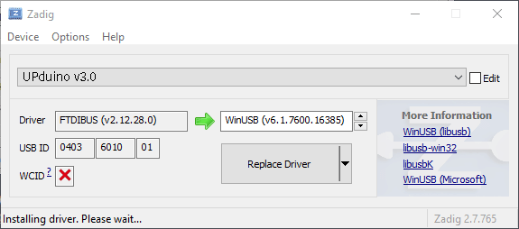

# Introduction

The built-in programmer in Lattice Radiant can have trouble talking to the UPduino over its FTDI USB chip. This page explains how to install [openFPGALoader](https://github.com/trabucayre/openFPGALoader), a more reliable programmer. It also sets up the USB driver that lets [Jacquard](https://jacquardfpga.com/) program your board straight from the browser. (Thanks Prof. Brake!)

You need a `.bin` bitstream file to program the FPGA. Where it comes from depends on which tool you synthesized with.

## Getting the bitstream from Jacquard

In [Jacquard](https://jacquardfpga.com/), you can bring in an existing lab with **GitHub** at the top of the page. Paste the link to the folder from your repository, for example `https://github.com/<user>/<repo>/tree/main/lab1`. If the folder name has spaces, type them as spaces. On the **Build** tab, pick your top module under **Design top**, then assign a pin to each port. You can also load a Radiant `.pdc` with **Import pins**. Click **Synthesize**, then open the **Program** tab. From there you can either:

- click **Program** to write the design to the board from the browser (see [Programming from the browser](#programming-from-the-browser-jacquard)), or
- click **Download bitstream** to save `top.bin` and program the board from a terminal with the commands below.

The resulting window from the setps above should look as so:

{#fig-Jacquard}

## Getting the bitstream from Lattice Radiant

When you synthesize in Lattice Radiant, the bitstream is saved as `<project>_impl_1.bin`, usually in the `impl_1` folder of your project.

# Programming the FPGA

After you install openFPGALoader (instructions below), this command uploads a bitstream to the FPGA:

```bash
openFPGALoader -b ice40_generic -c ft232 -f <path_to_.bin_file>
```

For example, for a bitstream downloaded from Jacquard:

```bash
openFPGALoader -b ice40_generic -c ft232 -f top.bin
```

::: {.callout-note}
If you can't work out which path to use, ask in office hours or on Discord.
:::

If the board doesn't start after programming, press the UPduino's reset button or unplug it and plug it back in.

# Programming from the browser (Jacquard)

Jacquard's **Program** button writes the bitstream from the browser, so you don't need to install openFPGALoader. Use Chrome or Edge, because Firefox and Safari can't access USB devices. When you click **Program**, the browser asks which USB device to use. Choose the UPduino, and Jacquard writes the design to the board's flash.

## Windows users

Windows loads FTDI's own driver for the UPduino by default, and neither the browser nor openFPGALoader can open the board through it. Replace it with WinUSB by following step 3 of [Windows Option 2](#option-2-msys2). You only need to do this once per computer, and it fixes both Jacquard and openFPGALoader. If you skip it, Jacquard shows *"Windows needs the WinUSB driver once"* and openFPGALoader shows `Failed to claim cable`.

# macOS Install

First install [Homebrew](https://brew.sh/) if you don't already have it.

Then install openFPGALoader:

```bash
brew install openfpgaloader
```

Now you can upload code with the commands [above](#programming-the-fpga).

# Windows Install

This only works on personal computers, not lab computers, because installing the software and driver requires admin access. (We're working on this.)

## Option 1: WSL

Follow the instructions at [github.com/DFiantWorks/openFPGALoaderWSL](https://github.com/DFiantWorks/openFPGALoaderWSL) to install openFPGALoader inside WSL2. It also installs usbipd-win, which passes the UPduino from Windows through to WSL.

Once it's installed, run the commands [above](#programming-the-fpga), replacing `openFPGALoader` with `openFPGALoaderWSL`. Windows paths work, for example:

```powershell
openFPGALoaderWSL -b ice40_generic -c ft232 -f C:\Users\<username>\Downloads\top.bin
```

While the UPduino is attached to WSL, Windows programs (including Jacquard in the browser and Radiant) can't see it. openFPGALoaderWSL detaches it when it finishes. If the board disappears, unplug it and plug it back in.

## Option 2: MSYS2

This option also sets up the driver that Jacquard's in-browser **Program** button needs.

**1. Install MSYS2.** Download and install [MSYS2](https://www.msys2.org/), or run `winget install MSYS2.MSYS2` in PowerShell. It should open a terminal window like the one in @fig-msys2. If it doesn't, open the **MSYS2 UCRT64** app from the Start menu.

{#fig-msys2}

**2. Install openFPGALoader.** Run this command in the terminal. To paste, right-click or press Shift+Insert, because Ctrl+V doesn't work:

```bash
pacman -S mingw-w64-ucrt-x86_64-openFPGALoader
```

Check that it installed by running `openFPGALoader -h`.

**3. Replace the USB driver.** Plug in the UPduino. Download and run [Zadig](https://zadig.akeo.ie/), and click **Yes** when Windows asks for admin permission. Select **Options → List All Devices**, then choose the UPduino from the dropdown. It shows up as *UPduino v3.0* or *UPduino v3.1*. Check that the USB ID boxes read `0403` `6014`.

::: {.callout-warning}
If you pick the wrong device you can break your mouse or keyboard, so check the USB ID before you continue.
:::

Make sure the driver to the right of the green arrow is **WinUSB**. It should look like @fig-zadig:

{#fig-zadig}

Click **Replace Driver** and wait for it to finish. Then unplug the board and plug it back in. You won't need Zadig again on this computer.

To check that it worked, run `openFPGALoader --scan-usb` in the MSYS2 terminal. The UPduino should be listed as `0x0403:0x6014 ... UPduino`.

After this change, Lattice Radiant's built-in programmer can no longer see the board, because Radiant needs the original FTDI driver. To undo it, open **Device Manager**, right-click the UPduino, choose **Uninstall device**, tick **Delete the driver software** if it's offered, then unplug and replug the board.

**4. Program the board.** Use `cd` to move to the folder that holds your bitstream. In MSYS2, `C:\` is written as `/c/`, for example:

```bash
cd /c/Users/<username>/Downloads
```

or, for a Radiant project:

```bash
cd /c/Users/<username>/Desktop/E155/lab_1
```

Then run the commands [above](#programming-the-fpga) to program your FPGA.

# Linux Install

Most distributions package it. On Debian/Ubuntu:

```bash
sudo apt install openfpgaloader
```

To use the board without `sudo` (which Jacquard's in-browser programming also needs), install the udev rules described in the [openFPGALoader install guide](https://trabucayre.github.io/openFPGALoader/guide/install.html).
